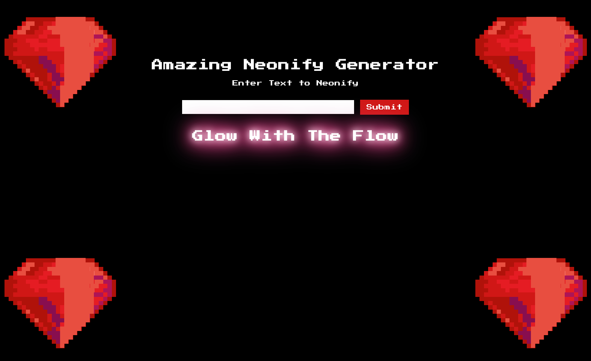
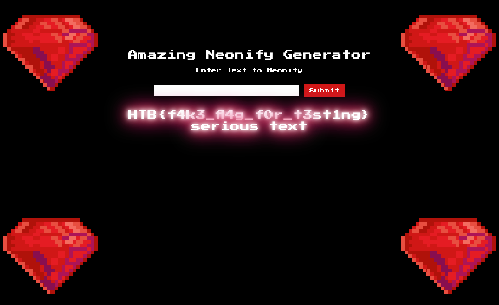

# Neonify

> É hora de uma brilhante revelação de um nunca antes visto "neonificador" de texto. Venha testar nosso mais novo website e faça qualquer texto brilhar como um tubo de neon de lo-fi.

Esse desafio consiste numa aplicação web em Ruby que estiliza a entrada do usuário para que ela receba um efeito Neon.&#x20;

## Reconhecimento

A aplicação possui apenas um campo para entrada de dados e um botão para enviar o texto informado.

<figure><figcaption><p>Neonify - Tela inicial</p></figcaption></figure>

Como o desafio fornece o código-fonte, podemos realizar uma análise para entender seu funcionamento. No index, perceba que a aplicação usa um template para carregar o texto informado pelo usuário:


```html
...SNIP
<h1 class="title">Amazing Neonify Generator</h1>
<form action="/" method="post">
    <p>Enter Text to Neonify</p><br>
    <input type="text" name="neon" value="">
    <input type="submit" value="Submit">
</form>
<h1 class="glow"><%= @neon %></h1> <!-- observe essa linha -->
SNIP...
```


Esse template é alimentado pelo arquivo `neon.erb`, que por sua vez recebe a entrada do usuário por meio de uma requisição `POST`, realiza uma validação e renderiza na página.


```ruby
class NeonControllers < Sinatra::Base

  configure do
    set :views, "app/views"
    set :public_dir, "public"
  end

  get '/' do
    @neon = "Glow With The Flow"
    erb :'index'
  end

  post '/' do
    if params[:neon] =~ /^[0-9a-z ]+$/i
      @neon = ERB.new(params[:neon]).result(binding)
    else
      @neon = "Malicious Input Detected"
    end
    erb :'index'
  end

end
```


Esse código valida o parâmetro POST `neon` por meio de [regular expression](https://www.devmedia.com.br/iniciando-expressoes-regulares/6557) e identifica a presença de caracteres que não sejam numerais ou letras de A a Z. Logo a seguir, esse parâmetro é retornado para alimentar o template na página `index`.

## Exploração

Pesquisando, descobri que é possível o [bypass da expressão regular](https://exploit-notes.hdks.org/exploit/web/framework/ruby/ruby-on-rails-pentesting/#erb-template-injection) informando um payload de Server-Side Template Injection logo antes de uma quebra de linha. Dessa forma, a aplicação não consegue validar o payload malicioso e permite a injeção de templates na página.

## Prova de Conceito

O payload final ficou da seguinte forma:

```ruby
<%25= File.open('flag.txt').read %25>
bypassed
```

Atente-se à quebra de linha antes do `bypassed`, é ela que permite o funcionamento do payload. Interceptando o envio da requisição e definindo esse payload, obtemos o seguinte resultado:

<figure><figcaption><p>Neonify - Payload malicioso injetado</p></figcaption></figure>
