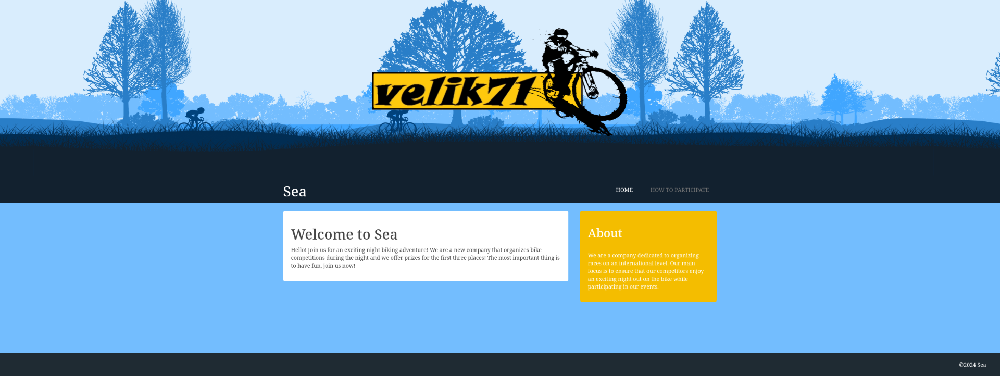
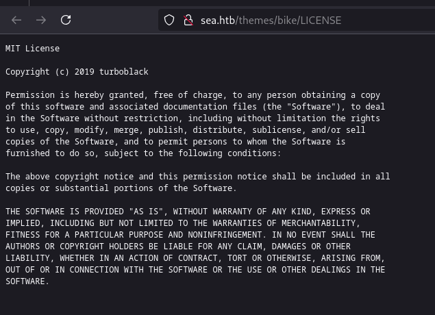
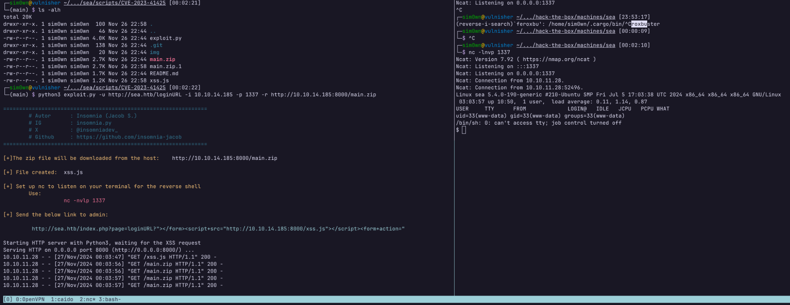
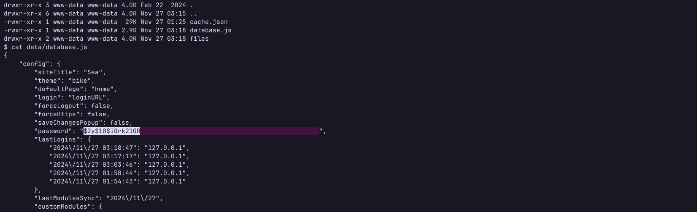
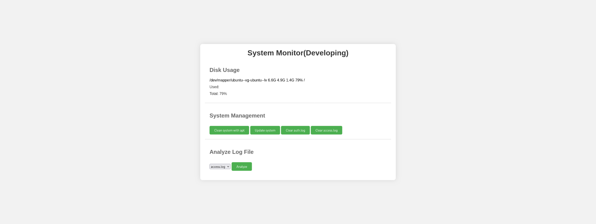
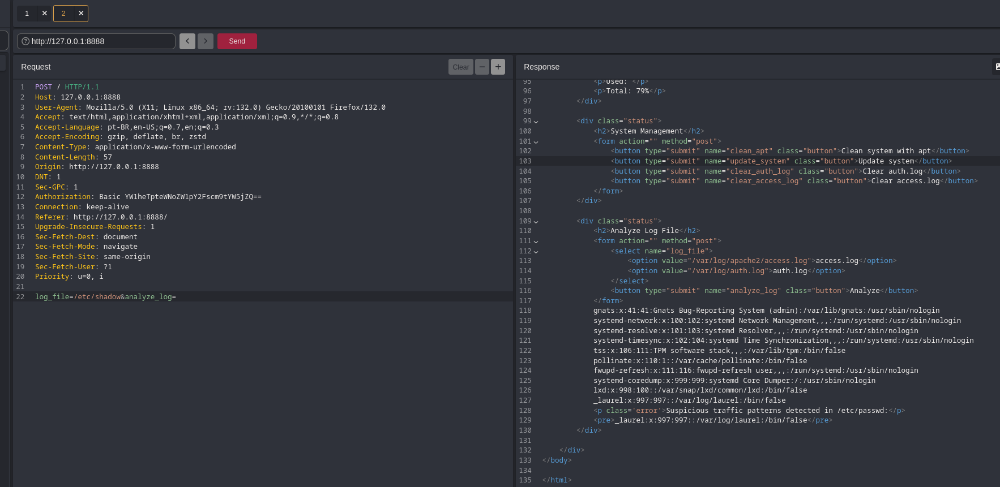
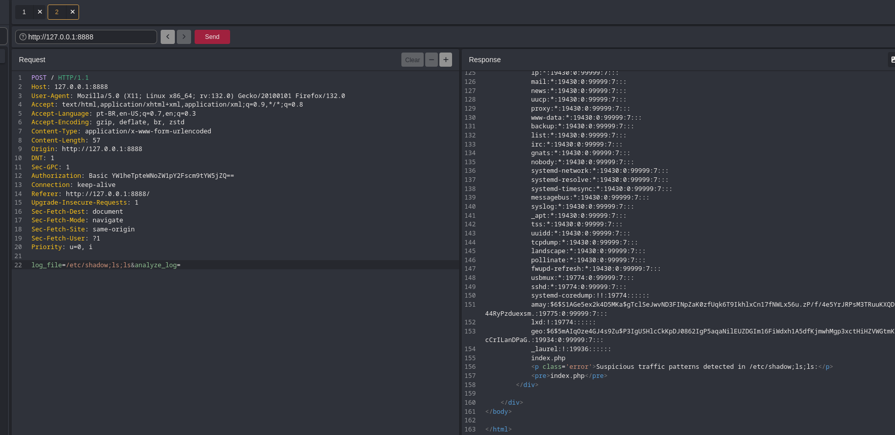
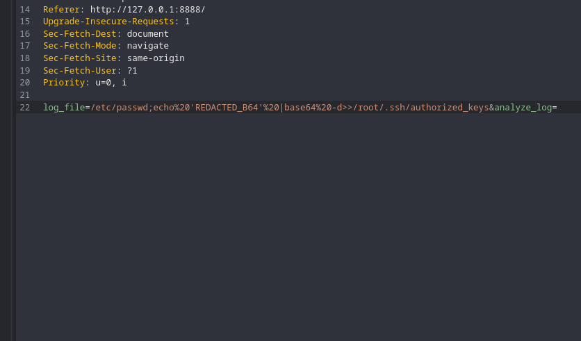

---
layout:
  title:
    visible: true
  description:
    visible: false
  tableOfContents:
    visible: true
  outline:
    visible: true
  pagination:
    visible: true
---

# Sea

## Reconhecimento

Como tenho apenas o IP da máquina e nenhuma outra informação, comecei a varrer a aplicação em busca de serviços que estivessem sendo executados. Após um scan completo com o nmap, identifiquei que a máquina expõe as portas 22 (SSH) e 80 (HTTP), onde um Apache está sendo executado. Ambos os serviços estão utilizando versões recentes, então não procurei explorá-los.


```bash
PORT   STATE SERVICE REASON  VERSION                                                                                                                                                                                                                                                      
22/tcp open  ssh     syn-ack OpenSSH 8.2p1 Ubuntu 4ubuntu0.11 (Ubuntu Linux; protocol 2.0)                                                                                                                                                                                                
| ssh-hostkey:                                                                                                                                                                                                                                                                            
|   3072 e3:54:e0:72:20:3c:01:42:93:d1:66:9d:90:0c:ab:e8 (RSA)                                                                                                                                                                                                                            
| ssh-rsa AAAAB3NzaC1yc2EAAAADAQABAAABgQCZDkHH698ON6uxM3eFCVttoRXc1PMUSj8hDaiwlDlii0p8K8+6UOqhJno4Iti+VlIcHEc2THRsyhFdWAygICYaNoPsJ0nhkZsLkFyu/lmW7frIwINgdNXJOLnVSMWEdBWvVU7owy+9jpdm4AHAj6mu8vcPiuJ39YwBInzuCEhbNPncrgvXB1J4dEsQQAO4+KVH+QZ5ZCVm1pjXTjsFcStBtakBMykgReUX9GQJ9Y2D2XcqVyLPxrT98rYy+n5fV5OE7+J9aiUHccdZVngsGC1CXbbCT2jBRByxEMn+Hl+GI/r6Wi0IEbSY4mdesq8IHBmzw1T24A74SLrPYS9UDGSxEdB5rU6P3t91rOR3CvWQ1pdCZwkwC4S+kT35v32L8TH08Sw4Iiq806D6L2sUNORrhKBa5jQ7kGsjygTf0uahQ+g9GNTFkjLspjtTlZbJZCWsz2v0hG+fzDfKEpfC55/FhD5EDbwGKRfuL/YnZUPzywsheq1H7F0xTRTdr4w0At8=          
|   256 f3:24:4b:08:aa:51:9d:56:15:3d:67:56:74:7c:20:38 (ECDSA)                                                                                                                                                                                                                           
| ecdsa-sha2-nistp256 AAAAE2VjZHNhLXNoYTItbmlzdHAyNTYAAAAIbmlzdHAyNTYAAABBBMMoxImb/cXq07mVspMdCWkVQUTq96f6rKz6j5qFBfFnBkdjc07QzVuwhYZ61PX1Dm/PsAKW0VJfw/mctYsMwjM=                                                                                                                        
|   256 30:b1:05:c6:41:50:ff:22:a3:7f:41:06:0e:67:fd:50 (ED25519)                                                                                                                                                                                                                         
|_ssh-ed25519 AAAAC3NzaC1lZDI1NTE5AAAAIHuXW9Vi0myIh6MhZ28W8FeJo0FRKNduQvcSzUAkWw7z                                                                                                                                                                                                        
80/tcp open  http    syn-ack Apache httpd 2.4.41 ((Ubuntu))                                                                                                                                                                                                                               
| http-cookie-flags:                                                                                                                                                                                                                                                                      
|   /:                                                                                                                                                                                                                                                                                    
|     PHPSESSID:                                                                                                                                                                                                                                                                          
|_      httponly flag not set                                                                                                                                                                                                                                                             
|_http-title: Sea - Home                                                                                                                                                                                                                                                                  
| http-methods:                                                                                                                                                                                                                                                                           
|_  Supported Methods: GET HEAD POST OPTIONS                                                                                                                                                                                                                                              
|_http-server-header: Apache/2.4.41 (Ubuntu)                                                                                                                                                                                                                                              
Service Info: OS: Linux; CPE: cpe:/o:linux:linux_kernel
```


Após abrir a aplicação no navegador, encontrei a seguinte página:

<figure><figcaption><p>Página inicial da aplicação</p></figcaption></figure>

Navegando nos links exibidos, fui redirecionado ao domínio `sea.htb`, então precisei adicionar esse domínio ao arquivo `/etc/hosts` da minha máquina, o que pôde ser feito da seguinte maneira (sendo "{IP\_DO\_ALVO}" o endereço IP da máquina):

```bash
echo "{IP_DO_ALVO} sea.htb" | sudo tee -a /etc/hosts
```

Continuei navegando pelas funcionalidades do site, e identifiquei uma vulnerabilidade de Server-Side Request Forgery na página de contato (após clicar em "How To Participate", obtive o link para essa página). Entretanto, no momento essa vulnerabilidade não me pareceu útil, então continuei explorando.

## Varredura

Comecei a escanear a aplicação web em busca de diretórios e arquivos. Após executar o `feroxbuster` com a wordlist big do repositório [SecLists](https://github.com/danielmiessler/SecLists), obtive os seguintes arquivos/diretórios:

```
http://sea.htb/plugins/george
http://sea.htb/themes/bike/LICENSE
http://sea.htb/themes/bike/summary
http://sea.htb/themes/bike/version
http://sea.htb/themes/bike/img/paid
```

A princípio, nada muito valioso. Depois de um tempo buscando mais informações sobre a aplicação, não encontrei mais nada que parecesse útil. Seguindo o OWASP WSTG[^1], busquei tentar entender melhor que [tecnologia compõe essa aplicação](https://owasp.org/www-project-web-security-testing-guide/v42/4-Web_Application_Security_Testing/01-Information_Gathering/02-Fingerprint_Web_Server). Verifiquei cada um dos arquivos encontrados, e no arquivo `LICENSE` o seguinte conteúdo é exibido:

<figure><figcaption><p>Arquivo LICENSE</p></figcaption></figure>

Pesquisando pelo autor (turboblack), pude encontrar uma [publicação](https://www.wondercms.com/community/viewtopic.php?t=830\&nbsp;) no blog de um CMS[^2] chamado WonderCMS. Essa informação foi valiosa, pois encontrei uma [CVE](https://github.com/insomnia-jacob/CVE-2023-41425) referente a esse CMS.

## Exploração

Seguindo as instruções para utilizar a PoC[^3] dessa CVE, obtive um shell na máquina:

<figure><figcaption><p>Acesso inicial à máquina</p></figcaption></figure>

Navegando pela máquina, encontrei um arquivo de configuração do CMS que expõe um hash:

<figure><figcaption><p>Hash do usuário "amay"</p></figcaption></figure>

Perdi mais tempo tentando quebrar esse hash do que gostaria de admitir, pois esse é um arquivo JavaScript e alguns caracteres estão sendo escapados na string... ou seja, foi preciso remover todos os caracteres escapados (prefixados com uma `\`), para poder crackear esse hash. Mas por fim, obtive o hash do usuário `amay`, e fiz login com esse usuário por meio do SSH.

## Pós-Exploração

Agora com o usuário `amay`, fiz um breve reconhecimento da máquina e encontrei um serviço sendo executado internamente pelo usuário `root` na porta 8080. Fiz [port-forwarding](https://book.hacktricks.xyz/generic-hacking/tunneling-and-port-forwarding#port2port) desse serviço com SSH para acessar localmente na minha máquina com o seguinte comando:

```bash
ssh amay@sea.htb -L 8080:127.0.0.1:8080
```

Com isso, pude acessar por meio do navegador e a seguinte página é exibida:

<figure><figcaption><p>Sistema interno de monitoramento</p></figcaption></figure>

Perceba que é possível selecionar um arquivo e exibir o conteúdo dele por meio dessa página. Se interceptarmos a requisição, é possível ver que o caminho do arquivo é passado por meio de um parâmetro `log_file`. Tentei alterar o caminho do arquivo para um arquivo sensível do Linux:

<figure><figcaption><p>Explorando o sistema de monitoramento</p></figcaption></figure>

E... foi possível acessar o arquivo. Isso significa que podemos ler arquivos arbitrariamente no sistema. Tentei escalar e injetar comandos por meio dessa parâmetro, e para minha surpresa o resultado do comando foi exibido na resposta:

<figure><figcaption><p>Execução de código remoto como root</p></figcaption></figure>

Com isso, inseri a chave pública da minha máquina no arquivo `/root/.ssh/authorized_keys`, o que possibilitou que minha máquina pudesse se conectar como usuário root via SSH sem precisar nem mesmo da senha:

<figure><figcaption><p>Escalando privilégio para root</p></figcaption></figure>

Agora bastou acessar a máquina por meio do seguinte comando:

```bash
ssh root@sea.htb
```

Listar o conteúdo da flag e inserir na plataforma.

[^1]: Web Security Testing Guide

[^2]: Content-Management System

[^3]: Proof of Concept
