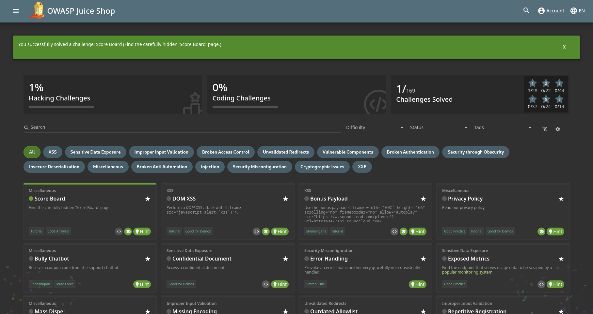

# Juice Shop

De acordo com [seu repositório do GitHub](https://github.com/juice-shop/juice-shop),

> O OWASP Juice Shop é (provavelmente) a aplicação web vulnerável mais moderna e sofisticada.

Esse é um projeto da [OWASP](https://owasp.org/) que visa ser uma aplicação propositalmente vulnerável para servir como material de estudo e prática da exploração das principais vulnerabilidades web. Sua configuração está documentada no GitHub e existem várias formas de instalação, cabendo a você escolher a forma mais prática no seu ambiente. No meu caso, estarei utilizando o [container Docker](https://github.com/juice-shop/juice-shop?tab=readme-ov-file#docker-container) através do Podman. Para isso, bastou executar o seguinte comando:


```bash
$ podman run --rm -p "127.0.0.1:3000:3000" docker.io/bkimminich/juice-shop
```


O comando acima executa a aplicação, buscando o container do repositório do Docker. A opção `--rm` informa que essa instância do container deve ser removida assim que sua execução for terminada, e a opção `-p "127.0.0.1:3000:3000"` faz com que a porta 3000, a qual a aplicação escuta dentro do container, deve ser disponibilizada para a máquina que está executando esse container.

### Primeiros passos

Após abrir a aplicação no navegador pela primeira vez, somos recebidos com uma mensagem de boas-vindas.

<figure><figcaption><p>Juice Shop - Mensagem de boas-vindas</p></figcaption></figure>

Ele apresenta um texto informativo sobre a aplicação, e oferece duas opções para fechar a janela. Ao clicar em "Help Getting Started", são apresentadas duas mensagens no canto superior esquerdo da página, uma informando que existe um placar e outra informando que ele pode ser acessado inspecionando a página com as ferramentas de desenvolvedor.

<figure><figcaption><p>Juice Shop - Dica sobre o placar</p></figcaption></figure>

Seguindo as instruções, podemos abrir as ferramentas de desenvolvedor e navegar até a aba "Debugger" (no Firefox). Com isso, podemos acessar o código-fonte do arquivo `main.js` e buscar pelo placar com o atalho `Ctrl + F`.

<figure><figcaption><p>Juice Shop - Encontrando o endpoint do placar</p></figcaption></figure>

Com isso, basta acessar o endpoint `/score-board` no navegador e seu primeiro desafio será resolvido.

<figure><figcaption><p>Juice Shop - Desafio do placar concluído</p></figcaption></figure>

Por fim, você pode mudar a linguagem para Português (Brasileiro), se preferir.
