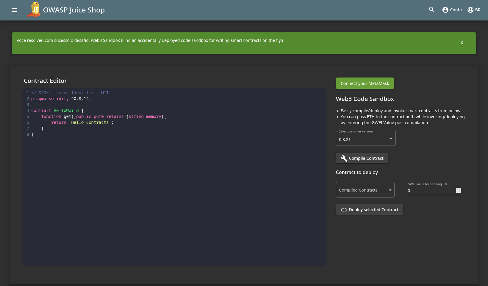
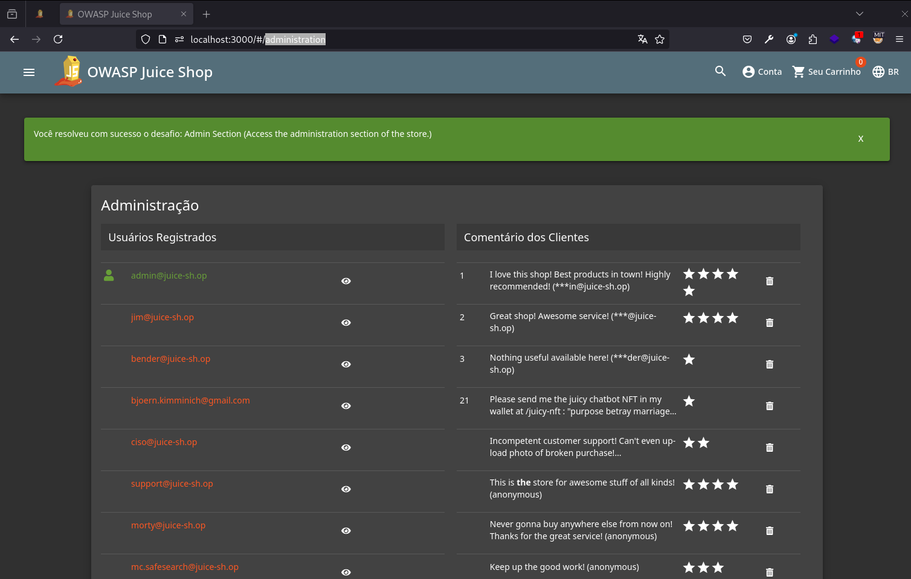
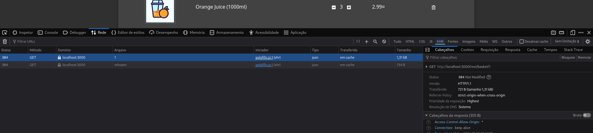

# Broken Access Control

## Web3 Sandbox

> Encontre um sandbox de código para escrever contratos em tempo real que foi implantado acidentalmente.

Esse desafio é bem simples e basta analisar o código-fonte da aplicação. Pesquisando `sandbox` no arquivo `main.js`, encontramos o caminho para acessar o sandbox.

<figure><figcaption><p>Juice Shop - Web3 Sandbox</p></figcaption></figure>

## Admin Section

> Acesse a seção administrativa da loja.

Para resolver esse desafio, você pode tentar adivinhar onde está localizado o painel do administrador ou descobrir por força bruta usando uma _wordlist_. Nesse caso, o painel está localizado no endpoint `/administration`.

<figure><figcaption><p>Juice Shop - Painel do administrador</p></figcaption></figure>

## View Basket

> Veja o carrinho de outro usuário.

Para esse desafio, podemos analisar as requisições que são realizadas ao acessar nosso carrinho.

<figure><figcaption><p>Juice Shop - Requisição a API ao endpoint do carrinho</p></figcaption></figure>

Perceba a requisição realizada ao endpoint `/rest/basket/1`. É uma chamada à API que retorna os produtos contidos no carrinho do usuário. Se tentarmos alterar o `1` por outro valor (2, por exemplo) e reenviar a requisição, a aplicação não realiza a devida validação e somos capazes de visualizar o carrinho de outro usuário, obtendo sucesso no desafio.

## Five-Star Feedback

> Livre-se dos feedbacks de 5 estrelas dos clientes.

Nesse desafio, é preciso uma noção de como uma API costuma ser estruturada. Ao acessar a página `Sobre Nós`, podemos observar uma requisição `GET` ao endpoint `/api/Feedbacks` que retorna a seguinte estrutura em JSON:

```json
{
  "status": "success",
  "data": [
    {
      "UserId": 2,
      "id": 2,
      "comment": "Great shop! Awesome service! (***@juice-sh.op)",
      "rating": 4,
      "createdAt": "2024-09-11T23:10:46.934Z",
      "updatedAt": "2024-09-11T23:10:46.934Z"
    },
    {
      "UserId": 3,
      "id": 3,
      "comment": "Nothing useful available here! (***der@juice-sh.op)",
      "rating": 1,
      "createdAt": "2024-09-11T23:10:46.938Z",
      "updatedAt": "2024-09-11T23:10:46.938Z"
    },
  ],
  ...SNIP...
}
```

Observe que dentro os atributos retornados para cada feedback está o `rating`, que seria quantas estrelas o usuário atribuiu. Podemos tentar alterar essa requisição informando um parâmetro `?rating=5` à URL, e agora serão resultados apenas os feedbacks com 5 estrelas. Dessa forma, já sabemos quais feedbacks teremos que remover. Agora, vamos navegar até a página que permite enviar um feedback, preencher ela e enviar. Observe que será feita uma requisição `POST` ao endpoint `/api/Feedbacks` com os seguintes dados no corpo da requisição:

```json
{
  "UserId": 22, // ID do usuário
  "captchaId": 2, // ID do captcha
  "captcha": "14", // Resposta ao captcha
  "comment": "This is a five star juice shop! (anonymous)", // Comentário
  "rating": 5 // Quantidade de estrelas
}
```

Podemos manipular essa requisição alterando o método para `GET` e adicionar um `/1` na URL, ficando `/api/Feedbacks/1`. Caso exista um feedback com o id 1, ele irá carregar esse feedback. Com isso, podemos tentar alterar o método para `DELETE` e ver como a aplicação se comporta. Nesse caso, a aplicação responde com o status de sucesso, e se tentarmos listar os feedbacks novamente, o feedback com id 1 não aparece. Ou seja, a aplicação não realizou nenhuma validação e foi possível remover o feedback com base em seu id. Agora basta unirmos todas essas informações para resolver o desafio. Podemos listar todos os feedbacks com id 5 e removê-los.
