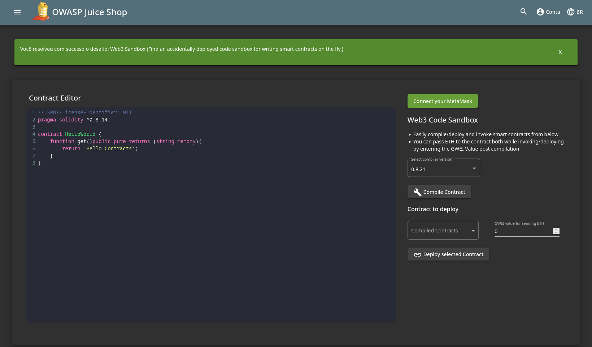

# Broken Access Control

## Web3 Sandbox

> Encontre um sandbox de código para escrever contratos em tempo real que foi implantado acidentalmente.

Esse desafio é bem simples e basta analisar o código-fonte da aplicação. Pesquisando `sandbox` no arquivo `main.js`, encontramos o caminho para acessar o sandbox.

<figure><figcaption>
Juice Shop - Web3 Sandbox
</figcaption></figure>
