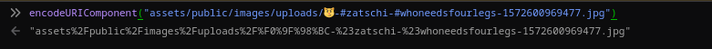
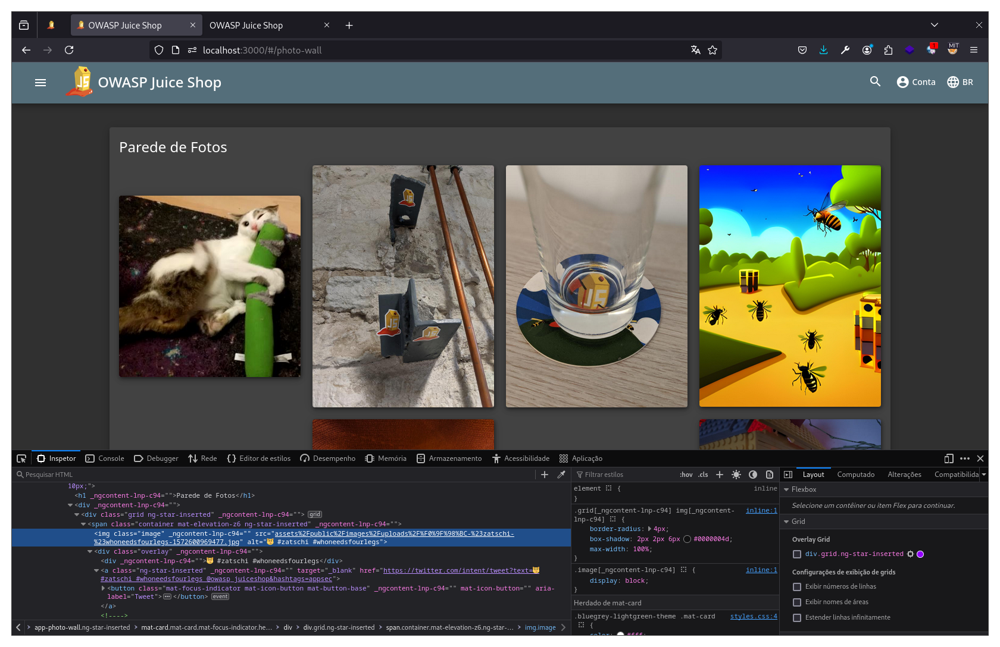

# Improper Input Validation

## Missing Encoding

> Recupere a imagem do gato do Bjoern no modo "combate melee".

Se acessarmos o mural[^1], vemos que uma das imagens não carregou corretamente. Ao inspecionar a página e investigar a URL dessa imagem, vemos que ela possui um emoji em sua URL. Nesse instante, o título do desafio é uma excelente dica, pois nesse caso a aplicação não codificou corretamente a URL e renderizou o emoji, fazendo com que a aplicação não encontrasse a imagem. Para corrigir isso, podemos copiar essa URL e codificar ela usando o próprio console das ferramentas de desenvolvedor e função `encodeURIComponent` do JavaScript.

<figure><figcaption>
Juice Shop - Codificando a URL da imagem adequadamente
</figcaption></figure>

Agora, basta trocarmos a URL não codificada pela codificada e a imagem irá carregar corretamente, solucionando o desafio.

<figure><figcaption>
Juice Shop - Recuperando a imagem com URL não codificada
</figcaption></figure>

## Repetitive Registration

> Siga o princípio DRY (Don't Repeat Yourself) ao registrar um usuário.

Para resolução desse desafio, é preciso explorar a falta de validação dos dados de entrada pela aplicação. Durante o processo de registro de usuário, se interceptarmos a requisição e remover o campo de confirmação de senha e encaminhá-la sem esse campo, a aplicação segue seu fluxo normalmente sem validar a entrada. Por fim, o desafio é resolvido.

## Zero Stars

> Dê um feedback devastador de zero estrelas à loja.

Para solucionar esse desafio, basta explorar a falta de validação da aplicação na funcionalidade de feedback. Se interceptarmos uma requisição de feedback, alterarmos o valor do atributo `rating` para 0 e encaminharmos, a aplicação não valida e o desafio é solucionado.

[^1]: "Parede de Fotos" no menu de navegação lateral&#x20;
