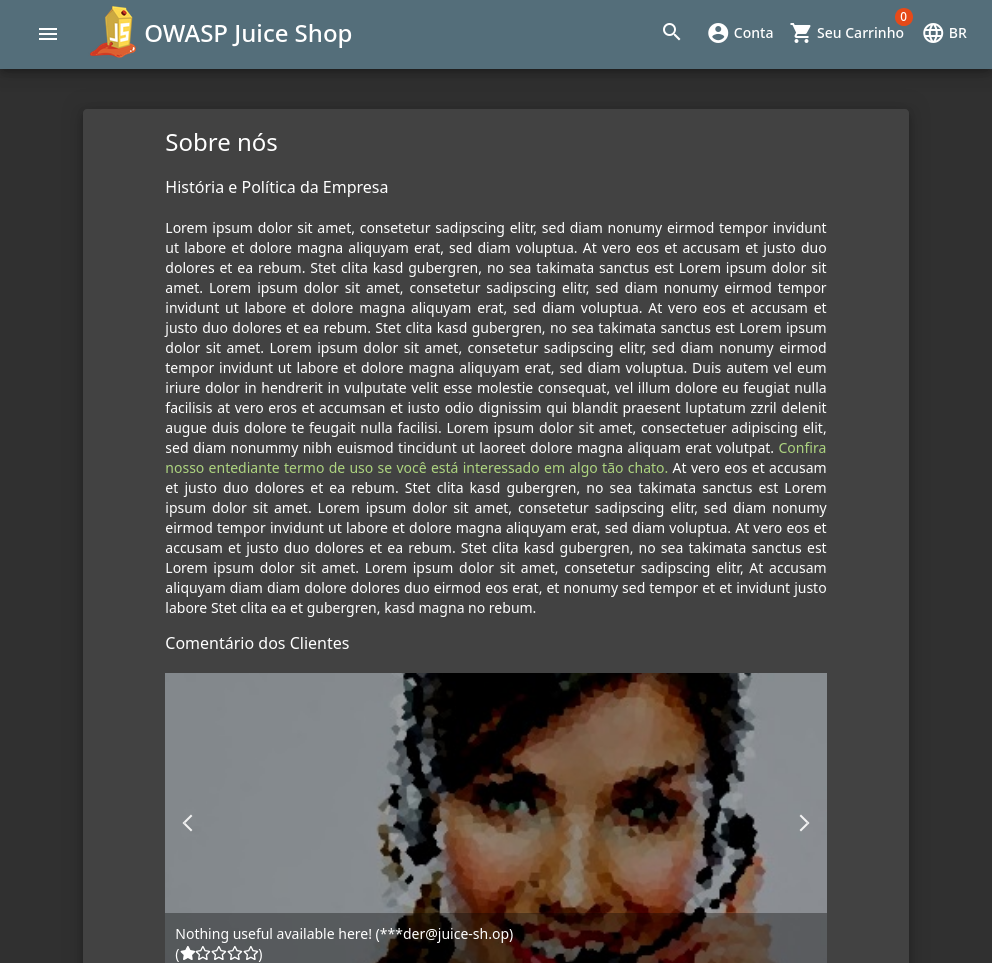
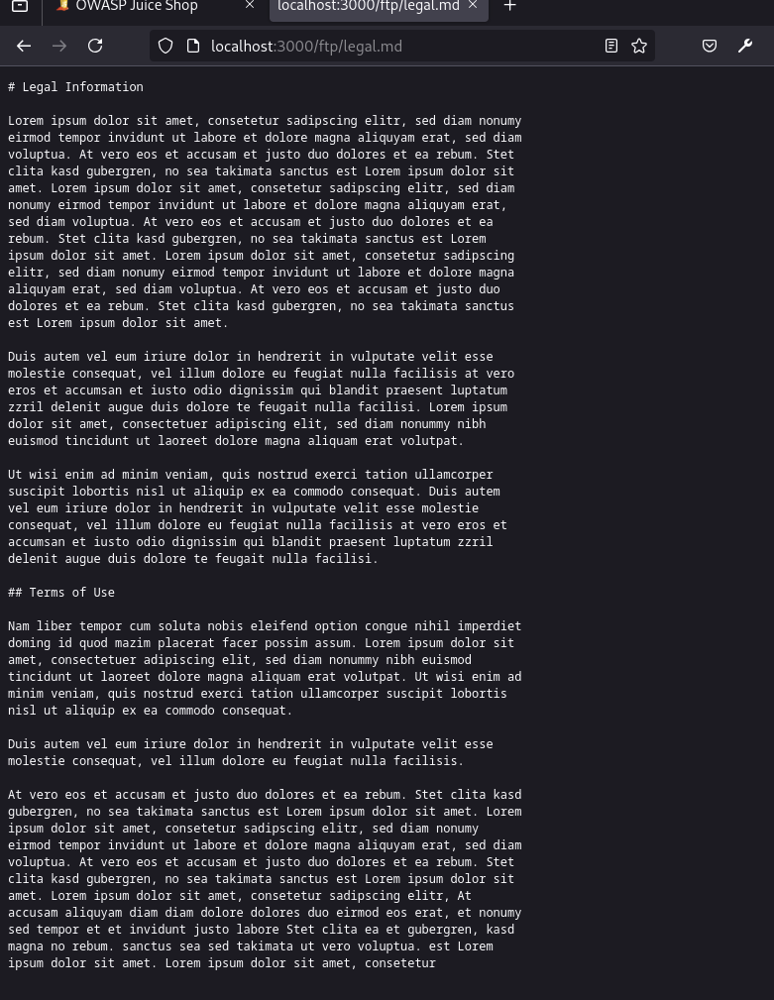

# Sensitive Data Exposure

## Confidential Document

> Acesse um documento confidencial.

Acessando o menu de navegação lateral, é possível encontrar a página "Sobre nós". Nela, é possível observar um link para acesso aos "termos de uso" da aplicação. Ao abrir ele, somos encaminhados para um diretório `/ftp`.

<figure><figcaption>
Juice Shop - Sobre nós
</figcaption></figure>

 

<figure><figcaption>
Juice Shop - Termos de Uso
</figcaption></figure>

Se voltarmos um diretório do arquivo aberto (isto é, acessarmos o diretório `/ftp`), é possível ver a listagem de arquivos desse diretório. Para solucionar o desafio, basta abrir o arquivo `aquisitions.md`.

## Exposed Metrics

> Encontre o endpoint que serve dados de uso para serem analisados por um [sistema de monitoramento popular](https://github.com/prometheus/prometheus).

Esse desafio pode ser resolvido por adivinhação manual ou ataque de força bruta, utilizando uma _wordlist_. Em ambos os casos, basta acessar o endpoint `/metrics`.
