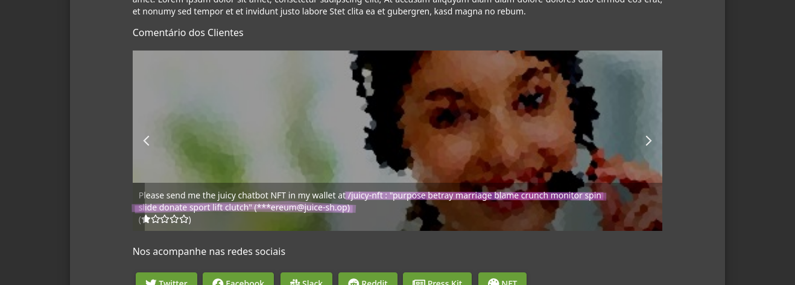

# Sensitive Data Exposure

## Confidential Document

> Acesse um documento confidencial.

Acessando o menu de navegação lateral, é possível encontrar a página "Sobre nós". Nela, é possível observar um link para acesso aos "termos de uso" da aplicação.

<figure><figcaption><p>Juice Shop - Sobre nós</p></figcaption></figure>

Ao abrir ele, somos encaminhados para um diretório `/ftp`:

<figure><figcaption><p>Juice Shop - Termos de Uso</p></figcaption></figure>

Se voltarmos um diretório do arquivo aberto (isto é, acessarmos o diretório `/ftp`), é possível ver a listagem de arquivos desse diretório. Para solucionar o desafio, basta abrir o arquivo `aquisitions.md`.

## Exposed Metrics

> Encontre o endpoint que serve dados de uso para serem analisados por um [sistema de monitoramento popular](https://github.com/prometheus/prometheus).

Esse desafio pode ser resolvido por adivinhação manual ou ataque de força bruta, utilizando uma _wordlist_. Em ambos os casos, basta acessar o endpoint `/metrics`.

## Login MC SafeSearch

> Faça login com o usuário do MC SafeSearch sem usar SQL injection ou qualquer outro bypass.

Para esse desafio, podemos acessar o painel de administrador e obter o e-mail do MC SafeSearch. A partir disso, podemos pesquisar por ele e vamos encontrar o [videoclipe](https://www.youtube.com/watch?v=v59CX2DiX0Y) dele falando sobre como garantir a segurança de suas senhas. Entretanto, ao longo da música, ele acaba acidentalmente expondo sua senha. Por fim, podemos interceptar a requisição de login (visto que o formulário não reconhece a senha) e usar suas credenciais para acessar a conta.

## Meta Geo Stalking

> Determine a resposta da pergunta de segurança do John com base num upload feito por ele ao mural de fotos e use-a para redefinir sua senha por meio do mecanismo de redefinição de senha.

Para esse desafio, podemos procurar pelo foto publicada pelo John e transferir ela. A partir disso, podemos usar uma ferramenta que permite a [geolocalização](https://jimpl.com/) com base nos metadados da imagem. Por fim, podemos acessar a funcionalidade de redefinição de senha, preencher o e-mail e a nova senha e informar a resposta para a pergunta de segurança, que nesse caso é `Daniel Boone National Forest`, local favorito do John para hiking.

## NFT Takeover

> Se aposse da carteira contendo nosso Soul Bound Token (NFT) oficial.

Para esse desafio, podemos nos aproveitar da exposição acidental de uma [seed phrase](https://crypto.com/university/pt-br/seed-phrases-for-crypto-wallets) na seção `Sobre Nós` da aplicação:

<figure><figcaption><p>Juice Shop - Seed phrase exposta</p></figcaption></figure>

Com isso, podemos usar um serviço de carteira de criptomoedas (no meu caso, utilizei a extensão do [MetaMask](https://addons.mozilla.org/en-US/firefox/addon/ether-metamask/)) para recuperar a chave privada da carteira gerada com essa seed phrase. Depois, basta copiar a chave privada gerada:

```
0x5bcc3e9d38baa06e7bfaab80ae5957bbe8ef059e640311d7d6d465e6bc948e3e
```

Por fim, conforme especificado no comentário em que a seed phrase foi exposta, inserir no endpoint `/juicy-nft` para resolver o desafio.

## Visual Geo Stalking

> Determine a resposta para a pergunta de segurança da Emma através de uma foto que ela enviou ao mural de fotos e use-a para redefinir sua senha através do mecanismo de "Esqueci minha senha"

Primeiramente, precisamos saber qual a pergunta de segurança para começar a buscar a resposta.

<figure><figcaption><p>Juice Shop - Pergunta de segurança da Emma</p></figcaption></figure>

Nesse caso, a pergunta de segurança é a primeira empresa que ela trabalhou enquanto adulta. Agora, podemos navegar até o mural de fotos e abrir a foto que ela publicou.

<figure><figcaption><p>Juice Shop - Imagem publicada pela Emma</p></figcaption></figure>

Aparentemente é apenas a imagem de um prédio. Porém, como o título do desafio sugere, podemos analisar visualmente a imagem para encontrar a resposta. Ao percorrer a imagem ampliada, é possível encontrar o seguinte "cartaz":

<figure><figcaption><p>Juice Shop - Resposta à pergunta de segurança da Emma</p></figcaption></figure>

Com isso, podemos deduzir que ela trabalhado na empresa "ITsec". Inserindo essa resposta no formulário de redefinição de senha, somos capazes de alterar a senha de Emma e o desafio é solucionado.
