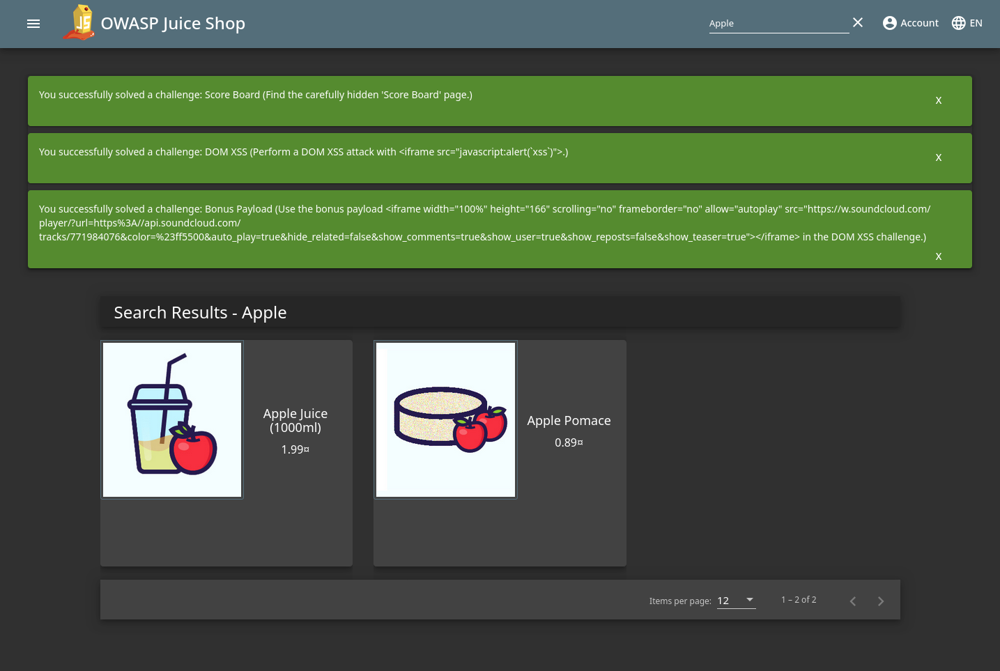
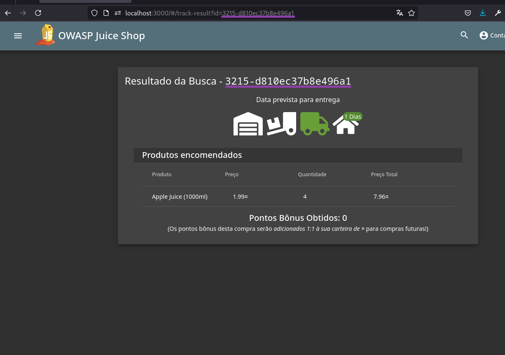

# Cross-Site Scripting (XSS)

## DOM XSS

> Execute um ataque de DOM XSS com ``<iframe src="javascript:alert(`xss`)">``.

O primeiro desafio dessa categoria é bem simples. Observando a aplicação, perceba o campo de busca na barra de navegação superior. Se tentarmos buscar por algo, como "Apple", temos o seguinte resultado:

<figure><figcaption>
Juice Shop - O termo de pesquisa é refletido na página
</figcaption></figure>

Repare que o parâmetro de busca informado é refletido na página de resultado. Se alteramos a busca para ``<iframe src="javascript:alert(`xss`)">``, o payload é refletido na página e solucionamos o desafio.

## Bonus Payload

> Use o payload bônus `<iframe width="100%" height="166" scrolling="no" frameborder="no" allow="autoplay" src="https://w.soundcloud.com/player/?url=https%3A//api.soundcloud.com/tracks/771984076&color=%23ff5500&auto_play=true&hide_related=false&show_comments=true&show_user=true&show_reposts=false&show_teaser=true"></iframe>` no desafio de DOM XSS.

Esse desafio é como o [anterior](xss.md#dom-xss), exceto que dessa vez devemos usar o payload especificado na descrição.

## Reflected XSS

> Realize um ataque de XSS refletido com ``<iframe src="javascript:alert(`xss`)">``.

Para esse desafio, podemos navegar pela aplicação e encontrar páginas onde alguma entrada é refletida na aplicação. Se fizermos uma compra, somos redirecionados para a página de rastreio logo após concluir o processo. Observe a barra de navegação: o **ID** do pedido é passado como [parâmetro na URL](https://www.hostinger.com.br/tutoriais/url#Parametros), e esse mesmo ID é refletido como resultado da busca pelo pedido.

<figure><figcaption>
Juice Shop - ID do pedido refletido na página
</figcaption></figure>

Se manipularmos esse ID, informando o payload de XSS, obtemos o seguinte resultado e o desafio é solucionado:

<figure><figcaption>
Juice Shop - XSS refletido
</figcaption></figure>
