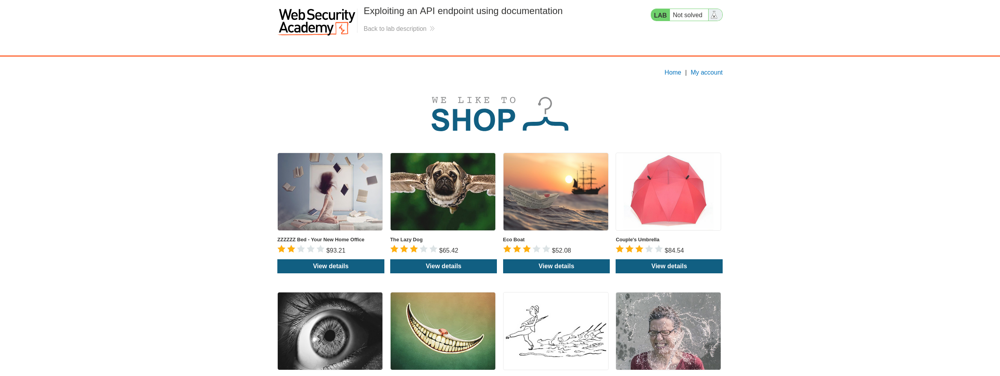
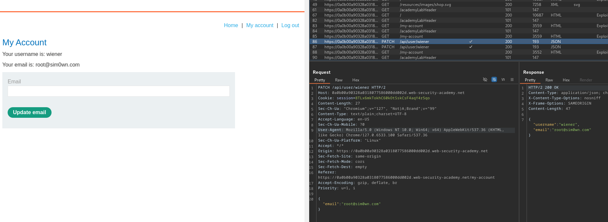
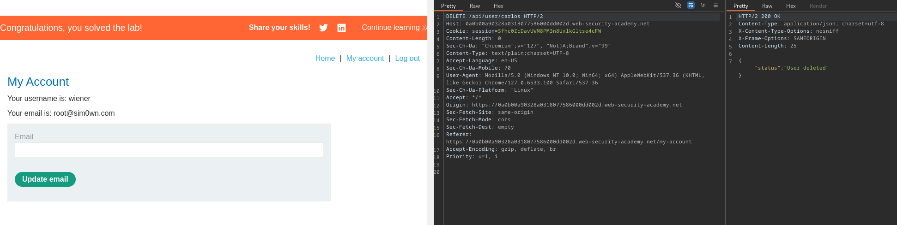

# Teste de API

## Utilizando a documentação para explorar um endpoint de API

> Para solucionar esse laboratório, encontre a documentação da API e remova o `carlos`. Você pode autenticar-se utilizando as credenciais `wiener:peter`.

Esse laboratório é bem simples, e basta apenas um pouco de noção sobre API e navegar pela aplicação.

<figure><figcaption><p>Laboratório I - Página inicial</p></figcaption></figure>

Conforme orientado na descrição, podemos abrir o laboratório e fazer login acessando "My account" e informando as credenciais `wiener:peter`.

<figure><figcaption><p>Laboratório I - Dashboard</p></figcaption></figure>

Após a autenticação, a aplicação apresenta um formulário em que é possível alterar o e-mail. Nesse caso, eu estava interceptando o tráfego com o Burp Suite e realizei uma troca de e-mail. Com isso, foi possível observar uma requisição com método PATCH ao endpoint `/api/user/wiener` passando um JSON com o parâmetro e-mail e o valor que informei no formulário.

<figure><figcaption><p>Laboratório I - Removendo o usuário "carlos"</p></figcaption></figure>

Enviei essa requisição para o Burp Repeater, removi o corpo da requisição (nesse caso, os dados JSON), alterei o método para DELETE e substituí o `wiener` por `carlos`. Ao enviar a requisição modificada, a aplicação não realiza nenhum controle e permite a exclusão do usuário `carlos`, concluindo a resolução desse laboratório.

## Encontrando e explorando um endpoint de API não utilizado

> Para solucionar esse laboratório, explore um endpoint de API escondido para comprar uma **Lightweight l33t Leather Jacket**. Você pode se autenticar usando as credenciais `wiener:peter`.

Como no desafio [anterior](api-testing.md#utilizando-a-documentacao-para-explorar-um-endpoint-de-api), podemos fazer login e navegar pela aplicação. Ao adicionar um produto no carrinho, é possível observar no histórico do Burp uma requisição ao endpoint `/api/products/1/price`, que retorna um JSON com o valor do produto. É normal que na construção de endpoints de API elas utilizem os métodos HTTP para identificar qual ação deve ser realizada.  Se enviarmos essa requisição para o Burp Repeater, podemos alterá-la e observar o comportamento da aplicação. Ao mudar o método para PATCH, adicionar um JSON ao corpo da requisição com um objeto "price" recebendo o valor 0, da seguinte forma:

```json
{
    "price": 0
}
```

adicionar o cabeçalho `Content-Type: application/json` e enviar, percebe-se que a aplicação apresenta uma resposta bem-sucedida indicando que o valor do produto agora é zero. Por fim, para resolver o desafio, basta adicionar uma **Lightweight l33t Leather Jacket** ao carrinho e prosseguir com a compra. Feito isso, o laboratório será marcado como resolvido.

## Explorando uma vulnerabilidade de atribuição em massa

> Para solucionar o laboratório, encontre e explore a vulnerabilidade de atribuição em massa para comprar uma **Lightweight l33t Leather Jacket**. Você pode se autenticar utilizando as credenciais `wiener:peter`.

Nesse laboratório, pode-se autenticar, navegar pela aplicação e adicionar o item pedido na descrição ao carrinho. Após isso, é possível verificar no histórico de requisições do Burp uma requisição `GET` ao endpoint `/api/checkout` que retorna um objeto JSON com diversas informações, tal como representado logo abaixo:


```json
{
"chosen_discount":
    {
        "percentage":0
    },
"chosen_products":
    [
        {
            "product_id":"1",
            "name":"Lightweight \"l33t\" Leather Jacket",
            "quantity":6,
            "item_price":133700
        }
    ]
}
```


Observe o objeto `chosen_discount` que possui um atributo `percentage`. Ao mudar o método da requisição ao endpoint `/api/checkout` para `POST` e enviar um objeto alterando o atributo `percentage` do objeto `chose_discount` para 100, obtém-se 100% de desconto no produto, permitindo que ele seja comprado. Com isso, o laboratório é resolvido.

## Explorando poluição de parâmetro do lado servidor em uma string de consulta

> Para solucionar o laboratório, faça autentique-se como `administrator` e remova o usuário `carlos`.

Nesse laboratório, é possível explorar a funcionalidade de recuperação de senha. Com um proxy interceptando as requisições, pode-se navegar para `My account` no menu e clicar em `Forgot password?`. Preencha e envie o formulário, observando as requisições que estão sendo salvas. Dentre as requisições, é possível encontrar o arquivo `/static/js/forgotPassword.js` que possui um código em JavaScript para realizar o processo de recuperação de senha. Se modificarmos a requisição POST feita anteriormente no formulário de recuperação de senha, podemos ver que ela recebe dois parâmetros, sendo eles um token CSRF e o outro o nome de usuário que informamos. Se inserirmos um `%23` (que no caso é um cerquilha URL-encoded) no final do corpo da requisição, a aplicação acusa um erro informando que o parâmetro `field` não foi informado. Isso significa que quando o cliente enviou a requisição ao servidor, o `%23` truncou a requisição e um atributo `field` que era adicionado ao final do corpo da requisição não foi interpretado pelo servidor, visto que qualquer dado inserido a partir do `%23` deixou de ser interpretado. Com isso, podemos continuar a exploração adicionando o parâmetro `field` manualmente. Para isso, pode-se utilizar um `%26`, que é um `&` URL-encoded e passar logo a seguir o parâmetro `field`, ficando da seguinte forma:


```http
csrf=QoNwa4oS40ngWOJCWXTk7277gjouUQH9&username=administrator%26field=A%23
```


Ao enviar a requisição dessa forma, a aplicação retorna uma resposta com o status `400` e um erro informando que o valor informado ao parâmetro `field` não é válido. Se analisarmos o arquivo JavaScript citado anteriormente, percebe-se que para recuperação de senha é necessário enviar uma requisição `GET` informando o parâmetro `reset_token`. Ou seja, `reset_token` é um atributo processado pela aplicação e pode ser um valor válido para o parâmetro `field`. Definido o `reset_token` no `field` e enviando a requisição, o servidor responde com o token para redefinição de senha do usuário administrador. Agora, basta realizar uma requisição `GET` para `/forgot-password?reset-token=`<mark style="color:purple;">`TOKEN_OBTIDO`</mark> e informar uma nova senha para o usuário `administrator`. Com isso, é possível fazer login na plataforma e acessar o painel do administrador, possibilitando a remoção do usuário `carlos` e obtendo sucesso no desafio.
