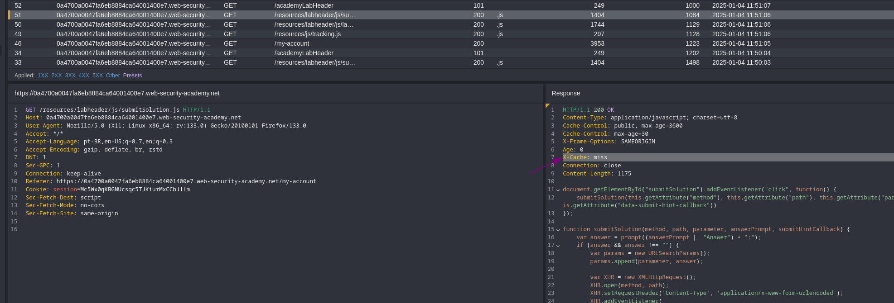
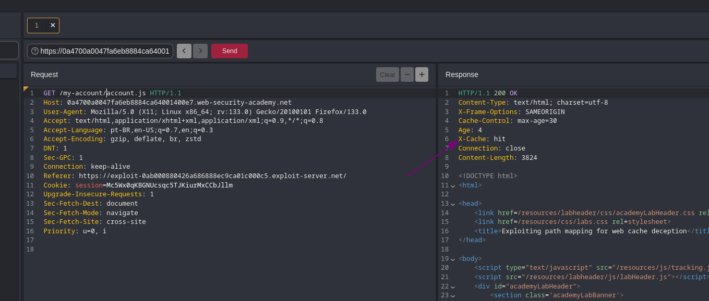
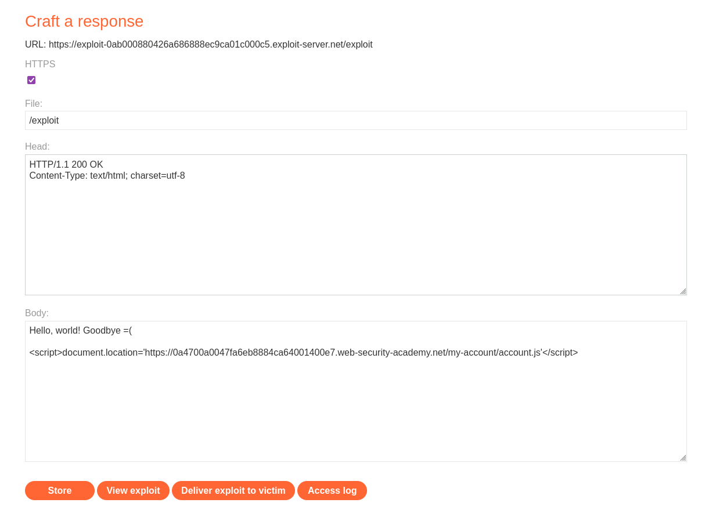
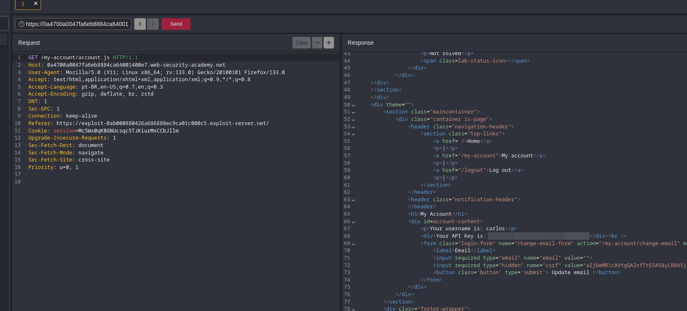

# Web Cache Deception

### Exploiting path mapping for web cache deception

> Para solucionar esse laboratório, encontre a API key para o usuário `carlos`. Você pode se autenticar usando as seguintes credenciais: `wiener:peter`.

Nesse laboratório, foi preciso explorar as regras de caching utilizadas pelo servidor. Para isso, busquei entender quais regras permitem que um recurso seja armazenado em cache para desenvolver um payload que ao ser enviado à vítima (nesse caso, o usuário `carlos`), o resultado fosse armazenado em cache e pudesse acessar posteriormente o resultado armazenado em cache.

Navegando pela página do laboratório, notei que as requisições a arquivos JavaScript recebiam um cabeçalho adicional:

<figure><figcaption>
Laboratório I - cabeçalho indicando sistema de cache em arquivos JavaScript
</figcaption></figure>

Com isso, tentei reenviar a requisição para a página de perfil a qual fui redirecionado assim que fiz login (`my-account`),  mas dessa vez inserindo um caminho `/account.js` ao final. Da primeira vez, o cabeçalho `X-Cache` foi adicionado à requisição com o valor `miss`. Reenviando, o resultado obtido foi o seguinte:

<figure><figcaption>
Laboratório I - manipulando o sistema de cache para armazenar recurso dinâmico
</figcaption></figure>

Com isso, descobri que o servidor processava o último parâmetro do caminho, e apenas retornava o conteúdo da página dinâmica `my-account`.  Ou seja, falta apenas desenvolver um payload que após enviado à vítima, redirecione para a página `my-account/account.js` e seja armazenado em cache para acessar posteriormente:

<figure><figcaption>
Laboratório I - exploit
</figcaption></figure>

Clicando em `Deliver exploit to victim` e reproduzindo a página `/my-account/account.js` pelo Caido, obtive a resposta para o laboratório:

<figure><figcaption>
Laboratório I - solução
</figcaption></figure>

